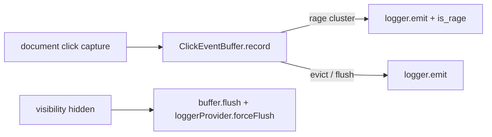

# Plan B — clicks OTLP logs + rage buffer

## Lifecycle

## Attributes

| Key | Individual | Rage |
|-----|------------|------|
| `pulse.type` | `app.click` | `app.click` |
| Log body | `app.widget.click` | `app.widget.click` |
| `click.type` | `good` \| `dead` | same |
| `click.is_rage` | omit | `true` |
| `click.rage_count` | omit | integer ≥ threshold |
| Coords / widget / context | per existing semconv | last cluster centroid metadata |

## Unit matrix

| Case | Expect |
|------|--------|
| 3 taps same area < window | one rage log, count ≥ 3 |
| Single tap then flush | one individual log |
| rage.enabled false | each tap emits immediately, no rage attrs |
| uninstall | no pending timeouts (dispose) |

## E2E

- Positive path: flush via simulated `visibilitychange` after click (buffered path).
- Rage path: rapid clicks on same control → one `app.click` with `click.is_rage=true`.
- Gate-off: seed config `click` feature off, `otlp.reset()`, click → **zero** `app.click` logs.
