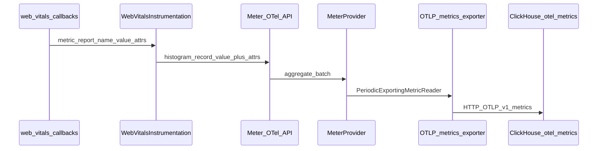

# ADR: Web Vitals capture in Pulse Web SDK

**Status:** Accepted (planning phase — implementation tracks this doc).  
**Date:** 2026-04-30  
**Context:** [01-research-otel-ecosystem-and-industry.md](./01-research-otel-ecosystem-and-industry.md), [02-research-otel-js-browser-and-pulse-sdk.md](./02-research-otel-js-browser-and-pulse-sdk.md), [03-touchpoints-matrix.md](./03-touchpoints-matrix.md).

---

## Context

Pulse Web SDK already ships OTLP metrics (`MeterProvider`, `/v1/metrics`), feature flags (`web_vitals`), and static `instrumentations.webVitals`, but does not register a Web Vitals instrumentation. Mobile SDKs use different performance signals (`screen_load`, `app.jank.*`) and do not emit browser Core Web Vitals.

---

## Decision

### D1 — Primary signal: OTLP **metrics**

- Use **`@opentelemetry/api` `metrics.getMeter`** (scope e.g. `pulse.web.web_vitals`) to record **histogram** (or gauge where appropriate) observations for each vital.
- Do **not** add a parallel HTTP beacon outside OTLP.

**Rationale:** Reuses `PeriodicExportingMetricReader`, `BeforeSendMetricExporter`, `SampledPushMetricExporter`, `GlobalAttributeInjectingMetricExporter`, disk buffering, and `pagehide` flush already implemented in [`exporters.ts`](../../src/exporters.ts).

### D2 — Instruments (initial set)

| Vital | `web-vitals` callback | Unit | Instrument pattern |
|-------|----------------------|------|---------------------|
| LCP | `onLCP` | ms | Histogram (single observation per reported value) |
| INP | `onINP` | ms | Histogram |
| CLS | `onCLS` | unitless | Histogram — record **delta** or final value per callback as aligned with `web-vitals` reporting API |
| FID | `onFID` (optional) | ms | Histogram — optional for legacy dashboards |

TTFB / FCP: **optional** Later milestone unless product requires (not Core Web Vitals trio).

Exact OTel **metric names** should follow lowercase dotted convention (e.g. `pulse.web_vital.lcp`) — finalize in implementation and mirror in [04-contract-parity.md](./04-contract-parity.md).

### D3 — `pulse.type` and filtering

- Every metric data point MUST carry attribute **`pulse.type = web_vital`** (string aligned with [`PulseWebSemconv`](../../src/semconv.ts) once added).
- Add **`web_vital.name`** (or `web_vital.metric_name`) attribute: `LCP` | `INP` | `CLS` | `FID` | … for breakdown in queries.

**Rationale:** Matches Pulse’s cross-signal convention for ClickHouse filters (`PulseType` column derived from attributes on traces/logs; metrics rely on attribute maps / unified metrics view).

### D4 — Correlation attributes

Reuse existing global metric attributes from `getMetricGlobalAttrs()`:

- `session.id`, `screen.name`, `project.id`, `platform=web`, url attrs as already stamped by [`PulseGlobalAttributesProcessor`](../../src/processors/global-attrs-processor.ts).

Optional per callback from `web-vitals`:

- `navigationType` where available — map to stable attribute key (ADR implementation: pick one semconv-aligned name).

### D5 — Lifecycle

1. Install listeners only when **`FeatureGate`** enables `web_vitals` **and** `instrumentations.webVitals.enabled !== false`.
2. **`uninstall()`:** detach all `web-vitals` subscriptions / observers.
3. **`shutdown()`:** SDK already flushes `meterProvider` after `uninstallAll()` — ordering is correct; no duplicate flush in instrumentation.
4. **bfcache:** follow **`web-vitals`** recommended `reportAllChanges` / library defaults for restored pages; do not leak duplicate instruments across restore without uninstall path (detail in implementation).

### D6 — Logs / events

- **No** duplicate OTLP log emission for the same numeric series in MVP.
- If OTel **`browser.web_vital`** event parity is required later, add behind a dev flag — out of MVP scope.

### D7 — Backend remote config

- Add **`web_vitals`** to Java [`Features`](../../../backend/server/src/main/java/org/dreamhorizon/pulseserver/service/configs/models/Features.java) and default **`pulse_web_js`** row in [`DefaultSdkConfigTemplate`](../../../backend/server/src/main/java/org/dreamhorizon/pulseserver/service/configs/DefaultSdkConfigTemplate.java) so server-driven toggles match the web SDK string.

---

## Sequence (browser → storage)

---

## Consequences

### Positive

- Single pipeline for RUM metrics; consistent sampling and privacy hooks.
- Queryable in existing metrics tables without new collector forks.

### Risks / mitigations

| Risk | Mitigation |
|------|------------|
| Histogram cardinality (too many attrs) | Keep attribute set minimal; use bounded `web_vital.name` enum |
| CLS delta vs cumulative confusion | Document in contract; match `web-vitals` library semantics |
| Backend feature enum drift | Add `web_vitals` to Java `Features` and tests |

### Out of scope (this ADR)

- Pulse UI dashboards for CWV.
- Alert definitions on web vitals.

---

## Compliance

Implementation PRs must update [04-contract-parity.md](./04-contract-parity.md) if attributes change, and follow [05-implementation-and-test-plan.md](./05-implementation-and-test-plan.md) test gates.
