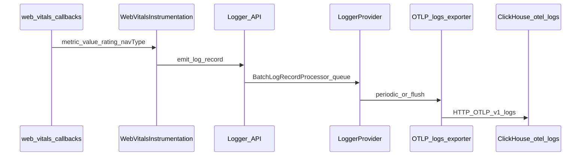

# ADR: Web Vitals capture in Pulse Web SDK

**Status:** Accepted — **Plan B (OTLP logs)** is the implementation track.  
**Date:** 2026-04-30 (updated for Plan B)  
**Context:** [PLAN-B-logs-events.md](./PLAN-B-logs-events.md), [01-research-otel-ecosystem-and-industry.md](./01-research-otel-ecosystem-and-industry.md), [03-touchpoints-matrix.md](./03-touchpoints-matrix.md).

---

## Context

Pulse Web SDK ships OTLP **logs** (`LoggerProvider`, `/v1/logs`) and OTLP metrics. Web Vitals use the **logs** pipeline. Remote feature `web_vitals` and static `instrumentations.webVitals` exist; instrumentation registers when gates allow. Mobile SDKs do not emit browser Core Web Vitals.

---

## Decision

### D1 — Primary signal: OTLP **logs**

- Emit one **log record** per vital report via `Logger.emit` and existing `BatchLogRecordProcessor` → `/v1/logs`.
- Do **not** add OTLP **metrics** histograms for vitals in this track (avoids per-callback `meterProvider.forceFlush` ordering concerns; see [PLAN-B](./PLAN-B-logs-events.md)).
- Do **not** add a parallel HTTP beacon.

**Rationale:** Same pipeline as session, errors, interactions; `pagehide` / optional `visibilitychange` + `pageshow` flushes align with Plan B.

### D2 — Vitals and optional metrics

| Vital | `web-vitals` callback | Log attributes |
|-------|----------------------|----------------|
| LCP | `onLCP` | `web_vital.name`, `web_vital.value` (ms), `web_vital.rating`, optional `web_vital.navigation_type` |
| INP | `onINP` | same shape |
| CLS | `onCLS` | same shape (unitless score) |
| FID | `onFID` | opt-in via `instrumentations.webVitals.fid` (default off) |
| FCP | `onFCP` | opt-in via `instrumentations.webVitals.fcp` (default off) |

Default `reportAllChanges: false` — one callback per vital per navigation where applicable (per `web-vitals`).

### D3 — `pulse.type` and body

- **`pulse.type = web_vital`** on every web vital log record ([`PulseWebSemconv`](../../src/semconv.ts)).
- **`LogBody.WEB_VITAL`** = `"web_vital"` (stable body string for filtering).

### D4 — Correlation attributes

`PulseGlobalAttributesProcessor` stamps `session.id`, `screen.name`, `project.id`, `platform`, URL attrs on **logs** same as other records — instrumentation does not duplicate them.

**`web_vital.navigation_type`:** omit attribute key when `metric.navigationType` is undefined.

### D5 — Lifecycle

1. Install only when **FeatureGate** `web_vitals` on and `instrumentations.webVitals.enabled !== false`.
2. **`visibilitychange` (hidden):** call `loggerProvider.forceFlush()` — fires every hide; idempotent; **do not** use `{ once: true }`.
3. **`pageshow` (persisted):** `forceFlush()` on bfcache restore for queued records.
4. **`uninstall()`:** remove DOM listeners with stored refs; **`web-vitals` v4** has **no** public cancel for `onLCP`/`onINP`/etc. — documented limitation.
5. **`shutdown()`:** existing SDK order — `uninstallAll()` then `loggerProvider.forceFlush()`.

### D6 — Metrics / duplicate signals

- **No** OTLP metrics for the same vitals in this track — logs **replace** metrics for vitals MVP.

### D7 — Backend remote config

- **`web_vitals`** on Java [`Features`](../../../backend/server/src/main/java/org/dreamhorizon/pulseserver/service/configs/models/Features.java) and default **`pulse_web_js`** row in [`DefaultSdkConfigTemplate`](../../../backend/server/src/main/java/org/dreamhorizon/pulseserver/service/configs/DefaultSdkConfigTemplate.java).

---

## Sequence (browser → storage)

---

## ClickHouse query note

`otel_logs.Attributes` stores string values. Use **`toFloat64(Attributes['web_vital.value'])`** for percentiles on LCP/INP/FCP/FID.

---

## Compliance

Update [04-contract-parity.md](./04-contract-parity.md) when attributes change. Implement per [PLAN-B-logs-events.md](./PLAN-B-logs-events.md) and execution checklist.

**Grill deferred:** Full [grill-me](../../../.cursor/skills/grill-me/SKILL.md) transcript not attached for this ADR revision; edge cases below are covered by **PLAN-B + Vitest** (`web-vitals-instrumentation.test.ts`: SSR, uninstall listener symmetry, `loggerProvider.forceFlush`, double `installAll`, gate-off) and **Playwright** (`web-vitals.spec.ts`: gate-disabled zero export, INP/Chromium). Remaining exploratory items (e.g. consent **PENDING** long soak, vitals × sampling matrix) tracked in PLAN-B / follow-up issues. **Owner:** Web SDK (branch author).
