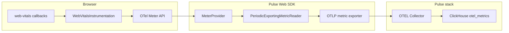

# Design: Core Web Vitals in Pulse Web SDK

**Version:** 1.0  
**Last updated:** 2026-04-30  
**Status:** Proposed (implementation should track [ADR-web-vitals.md](./ADR-web-vitals.md) and this document)

This document is the **engineering design** for browser Core Web Vitals (CWV) in Pulse. It consolidates research, decisions, contracts, and rollout. Detailed research memos and phase notes live in sibling files in this folder.

---

## 1. Purpose and scope

### 1.1 Goal

Capture **LCP**, **INP**, and **CLS** (and optionally **FID** for legacy consumers) from real user sessions using the same **OTLP metrics** pipeline as the rest of `@dreamhorizon/pulse-web`, with **remote** and **static** feature controls, **consent** gating, and **before-send** hooks—without a second beacon or ad-hoc HTTP channel.

### 1.2 In scope (MVP)

- New `WebVitalsInstrumentation` using Google’s [`web-vitals`](https://github.com/GoogleChrome/web-vitals) package (already a dependency).
- OTel **histogram** (or agreed instrument type) per vital, exported via existing `MeterProvider` → `/v1/metrics`.
- Semconv: `pulse.type`, `web_vital.*` attributes, alignment with [PulseWebSemconv](../../src/semconv.ts).
- Feature: `PulseFeature.WEB_VITALS` + `instrumentations.webVitals.enabled`.
- Backend: `Features.web_vitals` in pulse-server + default config row for `pulse_web_js`.
- Unit tests, Playwright E2E extension, entry in [agent-runtime test run log](../agent-runtime/test-run-log.md).

### 1.3 Out of scope (MVP)

- Pulse UI dashboards or alert definitions for CWV ( Later ).
- Duplicate OTLP **logs** mirroring the same numeric series ( Later / optional flag ).
- Android/iOS parity on **metric values** (mobile does not emit browser CWV; see §6).

---

## 2. Background

Pulse Web SDK already builds a **`MeterProvider`** with `PeriodicExportingMetricReader`, OTLP HTTP export, global metric attributes (`getMetricGlobalAttrs`), sampling, before-send, disk buffer, and `pagehide` flush ([`exporters.ts`](../../src/exporters.ts), [`sdk.ts`](../../src/sdk.ts)). Remote config types already include **`web_vitals`** ([`remote-config.ts`](../../src/types/remote-config.ts)), and [`InstrumentationRegistry`](../../src/instrumentation-registry.ts) maps **`InstrumentationKeys.WEB_VITALS`** to that feature—but **no instrumentation is registered** yet.

The Java backend **`Features`** enum today does **not** include `web_vitals`, so server-persisted SDK configs cannot name that feature consistently until the enum and default template are updated ([touchpoints §2](./03-touchpoints-matrix.md)).

---

## 3. Architecture

### 3.1 High-level data flow

### 3.2 Design principles (sanity workflow)

| Principle | Application |
|-----------|-------------|
| Single owner | One instrumentation class installs/uninstalls all `web-vitals` subscriptions. |
| One export path | Metrics only—no parallel beacon. |
| Contract hygiene | All `pulse.type` values and attribute keys via **`PulseWebSemconv`**; features via **`PulseFeature`** / **`InstrumentationKeys`**. |
| Same gates as other signals | Consent → feature gate → `instrumentations.webVitals.enabled` → sampling → `beforeSendMetric`. |

### 3.3 Sequence (metric report → storage)

See [ADR-web-vitals.md](./ADR-web-vitals.md) (mermaid sequence diagram). Summary: **`web-vitals`** invokes callback → instrumentation **`histogram.record`** (plus attributes) → batch export → OTLP → Collector → ClickHouse.

---

## 4. Data contract

### 4.1 `pulse.type`

- Add **`PulseWebSemconv.PulseType.WEB_VITAL`** with string value **`web_vital`** (aligned with [04-contract-parity.md](./04-contract-parity.md)).
- Every web vital **metric data point** carries **`pulse.type = web_vital`** so ClickHouse / analytics can filter consistently with traces/logs where attributes are materialized.

### 4.2 Metric instruments (initial)

| Vital | Library callback | Suggested metric name (finalize in PR) | Unit | Notes |
|-------|------------------|----------------------------------------|------|--------|
| LCP | `onLCP` | e.g. `pulse.web_vital.lcp` | ms | Largest Contentful Paint |
| INP | `onINP` | e.g. `pulse.web_vital.inp` | ms | Interaction to Next Paint |
| CLS | `onCLS` | e.g. `pulse.web_vital.cls` | unitless | Follow `web-vitals` semantics for delta vs session window |
| FID | `onFID` | optional | ms | Deprecated for CWV; optional for legacy |

Use **histograms** unless a specific vital requires a gauge (ADR default: histogram).

### 4.3 Attributes on each observation

**Required (design-level):**

- `pulse.type` → `web_vital`
- **`web_vital.name`** (or agreed key in semconv) → `LCP` | `INP` | `CLS` | `FID` | …
- **`web_vital.rating`** when provided by `web-vitals` (`good` / `needs-improvement` / `poor`)

**From global metric injection (existing):** `session.id`, `screen.name`, `project.id`, `platform`, URL fields as today.

**Optional:** navigation type / attribution fields from the Performance API—pick stable names at implementation and document in [04-contract-parity.md](./04-contract-parity.md).

### 4.4 What we do not duplicate (MVP)

- No second copy of the same measurement as an OTLP **log** record.
- Session replay UI **`coreWebVitals`** types remain a separate product surface ([touchpoints §4](./03-touchpoints-matrix.md)).

---

## 5. Configuration and feature gates

| Layer | Mechanism | Behavior |
|-------|-----------|----------|
| Consent | `PulseDataCollectionConsent` | If not `ALLOWED`, SDK never initializes providers—no vitals. |
| Remote | `features[]` with `featureName: "web_vitals"` and `sdks` including `pulse_web_js` | `FeatureGate`: explicit **`enabled: false`** disables; missing entry defaults **enabled** (see existing `m1` tests). |
| Static | `instrumentations.webVitals.enabled` | Default treat as `true` when undefined; `false` skips install. |
| Privacy | `beforeSendData` / `beforeSendMetric` | Can drop or redact metric payloads at export time. |
| Sampling | `ExportSamplingGate` | Vitals follow same session/signal sampling as other OTLP metrics. |

Installation predicate (conceptually):

`consent OK ∧ gate(web_vitals) ∧ config.webVitals.enabled !== false`.

---

## 6. Cross-SDK parity

- **Envelope parity:** Same notions as mobile—`pulse.type`, `session.id`, `project.id`, `platform`, SDK identity—not identical numeric signals.
- **Web-only:** LCP / INP / CLS / FID are **not** emitted by Android/iOS; optional documentation constant on Android semconv is for tooling only, not runtime emission from native SDKs.
- Full table: [04-contract-parity.md](./04-contract-parity.md).

---

## 7. Lifecycle and edge cases

| Concern | Design stance |
|---------|----------------|
| **Install order** | After `metrics.setGlobalMeterProvider` in `finishStart`—use `metrics.getMeter('pulse.web.web_vitals', …)` inside `install()`. |
| **uninstall** | Remove all `web-vitals` subscriptions so no callbacks after shutdown. |
| **shutdown** | Registry `uninstallAll()` before `meterProvider.forceFlush()`—current SDK order is sufficient. |
| **pagehide / bfcache** | Rely on existing flush + keepalive; align with `web-vitals` reporting options for restored pages; avoid duplicate meters across restore (implementation detail). |
| **Cardinality** | Keep attribute set bounded; avoid unbounded URL strings in metric labels if it duplicates high-cardinality paths—prefer attrs already normalized by global processor. |

---

## 8. Cross-service touchpoints (summary)

| Area | MVP action |
|------|------------|
| **pulse-web-otel** | Semconv, instrumentation, registry, tests, demo/E2E |
| **backend/server** | `Features.web_vitals`, `DefaultSdkConfigTemplate` row for `pulse_web_js`, tests |
| **ingestion** | Validate OTLP histograms land in `otel_metrics*` (no mandatory schema change if attributes are standard) |
| **pulse-ui** | None for MVP |
| **pulse_ai** | None for MVP |

Full matrix: [03-touchpoints-matrix.md](./03-touchpoints-matrix.md).

---

## 9. Testing strategy (summary)

Aligned with [pulse-web-sdk-sanity](../../../.cursor/skills/pulse-web-sdk-sanity/SKILL.md):

1. **Unit:** Gate on/off, config off, consent denied, attribute shape, uninstall cleanup, before-send drop.
2. **Integration:** Metric export path / sampling / global attrs where feasible.
3. **E2E:** `yarn workspace ecommerce-demo e2e:web-sdk-gates` + vitals-specific coverage; Chromium minimum; log gaps for WebKit/Firefox in [test-run-log.md](../agent-runtime/test-run-log.md).
4. **Permutation matrix:** See [05-implementation-and-test-plan.md](./05-implementation-and-test-plan.md).

---

## 10. Rollout phases

Phases 0–5 (backend config → SDK core → export privacy → demo E2E → edge matrix → ops validation) with exit criteria: [05-implementation-and-test-plan.md](./05-implementation-and-test-plan.md).

---

## 11. Document index

| Document | Role |
|----------|------|
| **DESIGN.md** (this file) | Single design overview for reviewers |
| [ADR-web-vitals.md](./ADR-web-vitals.md) | Formal ADR / decisions |
| [01-research-otel-ecosystem-and-industry.md](./01-research-otel-ecosystem-and-industry.md) | External ecosystem research |
| [02-research-otel-js-browser-and-pulse-sdk.md](./02-research-otel-js-browser-and-pulse-sdk.md) | OTel JS + this repo wiring |
| [03-touchpoints-matrix.md](./03-touchpoints-matrix.md) | Repo-wide touchpoints |
| [04-contract-parity.md](./04-contract-parity.md) | Mobile vs web contract |
| [05-implementation-and-test-plan.md](./05-implementation-and-test-plan.md) | Phased implementation and tests |

---

## 12. Open decisions (track in implementation PR)

- Final **metric instrument names** (prefix `pulse.web_vital.*` vs OTel semconv names).
- Whether **FID** ships in MVP or first patch.
- Exact attribute key for **navigation type** (pick once; avoid renames).
