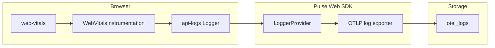

# Design: Core Web Vitals in Pulse Web SDK (Plan B)

**Version:** 1.1  
**Last updated:** 2026-05-01  
**Status:** **Plan B — OTLP logs** ([PLAN-B-logs-events.md](./PLAN-B-logs-events.md)) is the active implementation. [ADR-web-vitals.md](./ADR-web-vitals.md) matches this track.

---

## 1. Purpose and scope

### 1.1 Goal

Capture **LCP**, **INP**, **CLS**, **FCP**, **FID**, **TTFB** (all registered when `web_vitals` instrumentation installs) using the existing **OTLP logs** pipeline (`/v1/logs`), with remote/static gates, consent, **`beforeSendLog`**, and session sampling — no separate metrics path for vitals.

### 1.2 In scope (MVP)

- `WebVitalsInstrumentation` + [`web-vitals`](https://github.com/GoogleChrome/web-vitals).
- Semconv: `PulseType.WEB_VITAL`, `LogBody.WEB_VITAL`, `web_vital.*` attributes.
- Backend: `Features.web_vitals` + default template row for `pulse_web_js`.
- Unit + Playwright E2E; [test-run-log](../agent-runtime/test-run-log.md).

### 1.3 Out of scope (MVP)

- OTLP **metrics** for vitals ([PLAN-A](./PLAN-A-metrics-histogram.md) deferred).
- Pulse UI dashboards; duplicate log+metric for same vital.

---

## 2. Background

Logs pipeline is proven for sessions and errors. `MeterProvider` remains for other metrics; vitals do not use it. See [PLAN-B — Why logs](./PLAN-B-logs-events.md).

---

## 3. Architecture

**Principles:** single owner instrumentation; `logs.getLogger("pulse-web-vitals")`; `SdkContext.loggerProvider` for `forceFlush` on `visibilitychange` / `pageshow`; contract via `PulseWebSemconv`.

---

## 4. Data contract

- **Body:** `LogBody.WEB_VITAL` (`"web_vital"`).
- **Attrs:** `pulse.type = web_vital`, `web_vital.name`, `web_vital.value` (number in OTLP), `web_vital.rating`; `web_vital.navigation_type` **only if** defined.
- **ClickHouse:** cast `toFloat64(Attributes['web_vital.value'])` for aggregates.

---

## 5. Configuration and gates

Consent → `FeatureGate(web_vitals)` → `instrumentations.webVitals.enabled` → **`beforeSendLog`** (not beforeSendMetric for vitals) → `ExportSamplingGate` on log export.

Master off: **`instrumentations.webVitals.enabled === false`** disables the whole instrumentation (no per-vital toggles).

---

## 6. Cross-SDK parity

Unchanged envelope vs mobile; web-only attrs in [04-contract-parity.md](./04-contract-parity.md).

---

## 7. Lifecycle and SPA

- **Flush:** every `visibilitychange` to `hidden` and `pageshow` with `persisted` — see Plan B; no `{ once: true }` on visibility listener.
- **SPA / `screen.name`:** vitals measure **hard navigation**; `screen.name` / URL reflect **callback time** — read [PLAN-B § SPA navigation and screen.name accuracy](./PLAN-B-logs-events.md).

---

## 8. Touchpoints and testing

[03-touchpoints-matrix.md](./03-touchpoints-matrix.md). Tests: [PLAN-B](./PLAN-B-logs-events.md) matrix + execution plan Phase 5 bullets. E2E: allow **≥6s** after LCP-locking interaction or use test flush hook — see Plan B §E2E batch timing.

---

## 9. Document index

| Document | Role |
|----------|------|
| [PLAN-B-logs-events.md](./PLAN-B-logs-events.md) | **Primary spec** |
| [ADR-web-vitals.md](./ADR-web-vitals.md) | Decisions (logs-first) |
| **DESIGN.md** (this file) | Overview |
| [04-contract-parity.md](./04-contract-parity.md) | Contract |
| [05-implementation-and-test-plan.md](./05-implementation-and-test-plan.md) | Phased tests (may reference Plan A — treat vitals path as Plan B when conflicting) |
