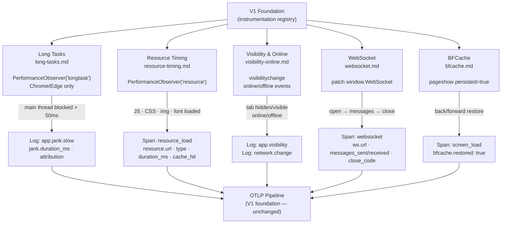

# Additional Instrumentations — Flow & Summary

Five supplementary auto-instrumentations extending the V1 signal set. All follow the same `install()` / `uninstall()` contract and are built in parallel. Three use `PerformanceObserver`; two patch browser globals.

---

## Flow

---

## Signal Reference

| Signal | Kind | File | Browser Support |
|---|---|---|---|
| `app.jank.slow` | Log | [long-tasks.md](./long-tasks.md) | Chrome/Edge only (graceful no-op on Firefox/Safari) |
| `resource_load` | Span | [resource-timing.md](./resource-timing.md) | All modern browsers |
| `app.visibility` | Log | [visibility-online.md](./visibility-online.md) | All browsers |
| `network.change` | Log | [visibility-online.md](./visibility-online.md) | All browsers |
| `websocket` | Span | [websocket.md](./websocket.md) | All browsers |
| `screen_load` (bfcache variant) | Span | [bfcache.md](./bfcache.md) | All browsers |

---

## Sub-Documents

| File | What It Captures | Key Attributes |
|---|---|---|
| [long-tasks.md](./long-tasks.md) | Main thread blocks > 50ms | `jank.duration_ms`, `jank.attribution` |
| [resource-timing.md](./resource-timing.md) | JS, CSS, image, font load times | `resource.url`, `resource.type`, `resource.transfer_size`, `resource.cache_hit` |
| [visibility-online.md](./visibility-online.md) | Tab visibility changes, online/offline | `visibility.state`, `visibility.duration_ms`, `network.online` |
| [websocket.md](./websocket.md) | Full WS connection lifecycle | `ws.url`, `ws.messages_sent/received`, `ws.bytes_*`, `ws.close_code` |
| [bfcache.md](./bfcache.md) | Back/forward cache restores | `bfcache.restored: true`, `navigation.type: 'back_forward'` |

---

## Key Design Decisions

| Decision | Rationale |
|---|---|
| `longtask` observer with feature-detect guard | Chrome-only API; must never throw on Firefox/Safari — graceful no-op required |
| `window.WebSocket` patching | Only way to intercept WS lifecycle without framework cooperation |
| `resource_load` applies same URL blocklist as `network` | Prevents Pulse CDN assets from appearing in resource timing (circular noise) |
| BFCache as a `screen_load` variant (not new signal type) | Keeps the signal taxonomy clean; `bfcache.restored: true` attribute differentiates |
