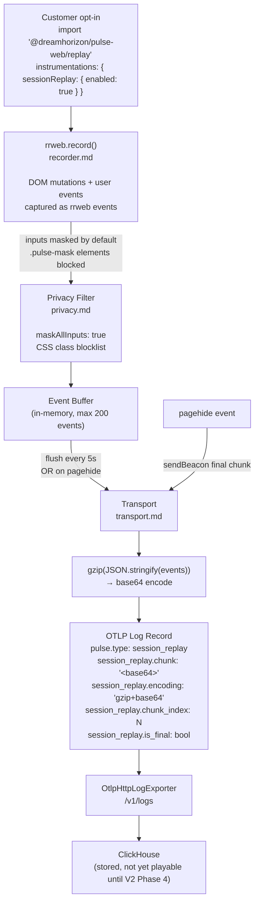

# Session Replay — Flow & Summary

DOM-level browser session recording via `rrweb`. Opt-in only — imported via a separate entry point so it adds zero weight to the default bundle. Privacy masking is on by default; data is delivered as compressed OTLP log chunks.

---

## Flow

---

## Sub-Documents

| File | What It Does |
|---|---|
| [index.md](./index.md) | Overview, how it fits together, constraints, done criteria |
| [recorder.md](./recorder.md) | rrweb setup, event buffering strategy, flush interval, batch splitting |
| [privacy.md](./privacy.md) | Input masking (on by default), CSS class blocklist, text redaction |
| [transport.md](./transport.md) | gzip compression, base64 encoding, OTLP log format, sendBeacon on unload |

---

## Key Constraints

| Constraint | Detail |
|---|---|
| **Opt-in only** | `import '@dreamhorizon/pulse-web/replay'` required — zero impact on core bundle |
| **rrweb bundle size** | +~50 KB gzip — acceptable since it's a separate entry point |
| **Not playable until V2 Phase 4** | Chunks land in ClickHouse from day one, but the rrweb player UI is built in Phase 4 (backend-ui) |
| **Privacy is enforced before the wire** | Masked content never reaches the network — applied in-browser before encoding |
| **Final chunk via sendBeacon** | Ensures the last chunk is delivered even when the tab closes abruptly |

---

## Key Design Decisions

| Decision | Rationale |
|---|---|
| `rrweb` as the recorder | Mature, battle-tested DOM recorder; handles shadow DOM, canvas, iframes |
| Separate `/replay` entry point | Core bundle stays < 30 KB; replay is ~50 KB extra — only customers who opt in pay the cost |
| Chunk-based OTLP log delivery | Fits into the existing log pipeline without a new transport mechanism |
| Privacy on by default (inputs masked) | Opt-out is safer than opt-in for PII — avoids accidental credential capture |
| `session_replay.chunk_index` attribute | Enables correct ordering in the rrweb player (ClickHouse ORDER BY timestamp as backup) |
