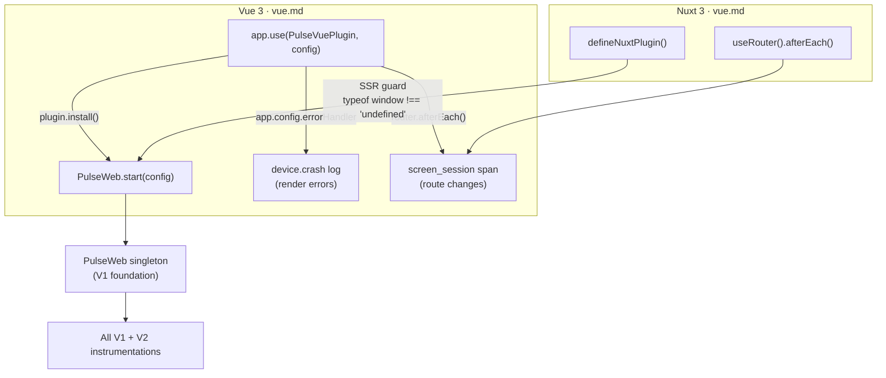

# Vue & Nuxt Integration — Flow & Summary

Idiomatic Vue 3 plugin with automatic route tracking via `vue-router`. Nuxt 3 support via a thin module wrapper. Both run in parallel with V2 Phase 1 instrumentation work.

---

## Flow



---

## Sub-Documents

| File | What It Covers |
|---|---|
| [vue.md](./vue.md) | Vue 3 plugin, vue-router integration, global error handler, Nuxt 3 module wrapper, SSR guard |

---

## Usage

### Vue 3
```typescript
import { createApp } from 'vue';
import { PulseVuePlugin } from '@dreamhorizon/pulse-web/vue';

createApp(App)
  .use(PulseVuePlugin, { endpointBaseUrl, apiKey, serviceName })
  .mount('#app');
```

### Nuxt 3
```typescript
// plugins/pulse.client.ts  (note: .client suffix = browser only)
export default defineNuxtPlugin(() => {
  PulseWeb.start({ endpointBaseUrl, apiKey, serviceName });
});
```

---

## Key Design Decisions

| Decision | Rationale |
|---|---|
| Vue plugin pattern (`app.use()`) | Idiomatic Vue API; integrates naturally into Vue app setup flow |
| `app.config.errorHandler` for errors | Vue catches render/lifecycle errors here before they propagate to `window.onerror` |
| `router.afterEach()` for routes | Standard Vue Router hook; fires after navigation is confirmed, not during guard evaluation |
| `.client` plugin suffix for Nuxt | Nuxt's way of ensuring a plugin runs browser-only; cleaner than manual `process.client` guards |
| Nuxt 3 only (not Nuxt 2) | Nuxt 2 is EOL; scoping to Nuxt 3 keeps the integration clean and future-proof |
