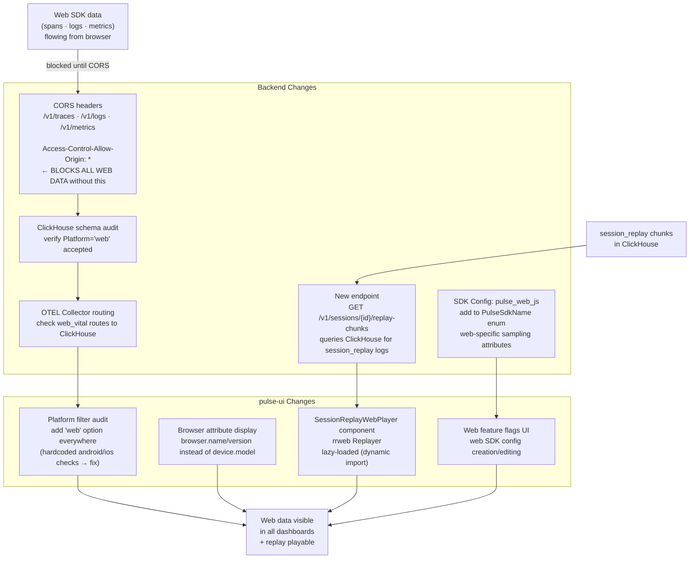

# Backend & UI — Flow & Summary

Makes web SDK data fully visible in existing Pulse dashboards, adds the rrweb session replay player, enables web-specific remote config flags, and adds CORS headers that unblock all browser data flow. This is the highest-risk phase — CORS and the session replay endpoint are both on the critical path.

---

## Flow

---

## Sub-Documents

| File | What It Covers |
|---|---|
| [index.md](./index.md) | Full implementation steps, ClickHouse verification queries, done criteria, known risks |
| [sdk-config-support.md](./sdk-config-support.md) | `pulse_web_js` SDK name, web-specific sampling attributes, CORS headers detail |
| [ui-support.md](./ui-support.md) | Platform filter audit, browser attribute display, Web Vitals screen, replay player, click heatmap |

---

## Priority Order

| Priority | Change | Why |
|---|---|---|
| 🔴 P0 | CORS headers on ingest endpoints | Without this, zero bytes flow from any browser |
| 🔴 P0 | `Platform = 'web'` filter in dashboards | Without this, web data is invisible even when flowing |
| 🟡 P1 | Session replay player | Unlocks replay data already in ClickHouse from V2 Phase 2 |
| 🟡 P1 | SDK Config `pulse_web_js` support | Enables remote feature gates for web |
| 🟢 P2 | Web Vitals screen | New dashboard screen — additive, no blocking dependency |
| 🟢 P2 | Click Heatmap | Coordinate data already captured in V1 clicks — needs UI visualisation |

---

## Key Design Decisions

| Decision | Rationale |
|---|---|
| CORS as first backend task | No web telemetry flows without it — must be done before any other validation |
| rrweb player lazy-loaded in UI | Adds rrweb (~100 KB) to the dashboard — dynamic import prevents bloating initial load |
| Replay chunks ordered by `chunk_index` (not timestamp) | rrweb Replayer is strict about ordering; `chunk_index` is a more reliable sort key than ClickHouse timestamp |
| Existing signal tables work for web | ClickHouse stores all attributes in nested arrays — no schema migration needed |
