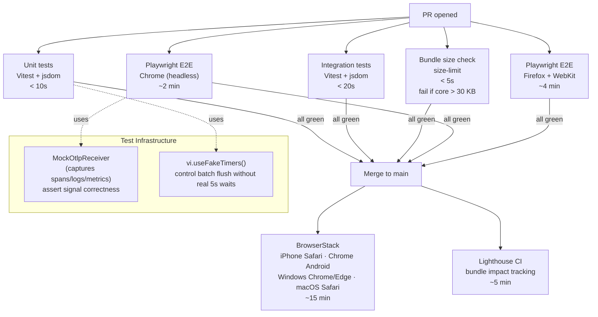

# Testing & Quality — Flow & Summary

A multi-layer test suite that locks in correctness from unit level through real-browser cross-platform E2E. Runs in parallel with V2 Phase 4 (backend-ui). Everything except BrowserStack runs on every PR.

---

## Flow

---

## Test Coverage Map

| Layer | Tool | What's Tested |
|---|---|---|
| Unit | Vitest | Session rotation, resource attributes, config parsing, APDEX scoring, interaction state machine |
| Integration | Vitest + jsdom | SDK singleton lifecycle, instrumentation toggling, consent gating |
| E2E Chrome | Playwright | Full signal flow: click → app.click log, fetch → http span, error → device.crash |
| E2E Firefox/WebKit | Playwright | Cross-browser correctness; longtask expected to skip gracefully |
| BrowserStack | Playwright | Real devices: iPhone Safari, Chrome Android |
| Bundle size | size-limit | Core < 30 KB, replay entry < 85 KB |

---

## Sub-Documents

| File | What It Covers |
|---|---|
| [index.md](./index.md) | Full Vitest config, MockOtlpReceiver implementation, Playwright config, BrowserStack setup, Lighthouse CI, done criteria, known risks |

---

## Key Design Decisions

| Decision | Rationale |
|---|---|
| `MockOtlpReceiver` as assertion target | Tests verify actual wire-format output, not internal state — catches serialisation bugs |
| Fake timers in unit tests | Eliminates 5s waits for batch flush; makes tests deterministic and < 1s each |
| `waitForRequest` in Playwright (not `waitForTimeout`) | Avoids flakiness from timer-dependent assertions in real browser tests |
| BrowserStack only on merge to main | Too slow (15 min) for every PR; catches real-device issues without blocking developer flow |
| Coverage thresholds: 80% lines / 75% branches | Pragmatic — high enough to catch regressions, low enough to not require tests for trivial code |
