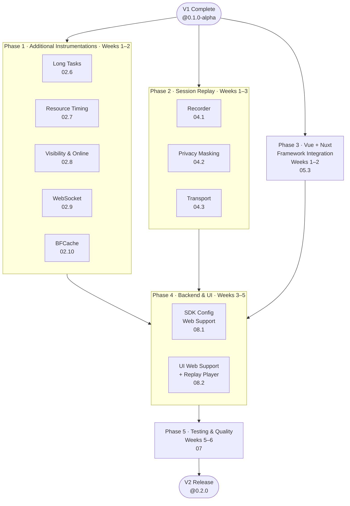

# Pulse Web SDK — V2 Plan

**Prerequisite:** V1 complete and stable (`@dreamhorizon/pulse-web@0.1.0-alpha`)
**Target:** `@dreamhorizon/pulse-web@0.2.0`
**Timeline:** ~6 weeks (after V1)
**Goal:** Full signal coverage, session replay, Vue/Nuxt, backend visibility, and a hardened cross-browser test suite.

---

## What V2 Adds (on top of V1)

| Feature | Status |
|---|---|
| Long Tasks (main thread jank) | ✅ V2 |
| Resource Timing (JS, CSS, images, fonts) | ✅ V2 |
| Visibility & Online/Offline events | ✅ V2 |
| WebSocket lifecycle tracking | ✅ V2 |
| BFCache (back/forward cache restores) | ✅ V2 |
| Session Replay (DOM recording via rrweb) | ✅ V2 |
| Vue 3 + Nuxt 3 integration | ✅ V2 |
| Backend: CORS + `pulse_web_js` SDK Config support | ✅ V2 |
| UI: Web Vitals dashboard screen | ✅ V2 |
| UI: rrweb session replay player | ✅ V2 |
| UI: Click Heatmap visualisation | ✅ V2 |
| BrowserStack E2E test suite (cross-browser) | ✅ V2 |

---

## Phase Dependency Diagram



> Phases 1, 2, and 3 all start in parallel immediately after V1 is stable. Backend & UI (Phase 4) starts once signals are flowing from the new instrumentations and replay chunks are landing in ClickHouse. Testing (Phase 5) is the final gate before V2 release.

---

## Phase 1 — Additional Instrumentations
**Weeks 1–2 · Docs: `02.6` – `02.10`**

Five remaining auto-instrumentations. All follow the same `install()` / `uninstall()` contract from V1. Built in parallel by different engineers.

### Long Tasks (`v2/01-instrumentations/long-tasks.md`)

| Signal | Kind | Trigger |
|---|---|---|
| `app.jank.slow` | Log | Main thread blocked > 50 ms |

Uses `PerformanceObserver` with `longtask` entry type (Chrome/Edge only). Gracefully no-ops on Firefox/Safari with a feature-detect guard — never throws.

Attributes: `jank.duration_ms`, `jank.attribution` (which frame caused the block), `screen.name`.

---

### Resource Timing (`v2/01-instrumentations/resource-timing.md`)

| Signal | Kind | What's captured |
|---|---|---|
| `resource_load` | Span | Every JS, CSS, image, font, and API resource |

Uses `PerformanceObserver` with `resource` entry type. Attributes: `resource.url`, `resource.type` (`script` / `stylesheet` / `image` / `fetch`), `resource.duration_ms`, `resource.transfer_size`, `resource.cache_hit` (transferSize === 0 → likely cache).

URL blocklist applies — same list as network instrumentation.

---

### Visibility & Online (`v2/01-instrumentations/visibility-online.md`)

| Signal | Kind | Trigger |
|---|---|---|
| `app.visibility` | Log | `document.visibilitychange` — tab hidden / visible |
| `network.change` | Log | `window.online` / `window.offline` events |

Attributes on `app.visibility`: `visibility.state` (`hidden` / `visible`), `visibility.duration_ms` (how long the tab was hidden).
Attributes on `network.change`: `network.online` (boolean), `network.connection.type`, `network.effective_type`.

---

### WebSocket (`v2/01-instrumentations/websocket.md`)

| Signal | Kind | What's captured |
|---|---|---|
| `websocket` | Span | Full WS connection lifecycle |

Patches `window.WebSocket`. Tracks: `ws.url`, `ws.open_duration_ms`, `ws.messages_sent`, `ws.messages_received`, `ws.bytes_sent`, `ws.bytes_received`, `ws.close_code`, `ws.error`.

The span starts on `new WebSocket()` and ends on `close` or `error`.

---

### BFCache (`v2/01-instrumentations/bfcache.md`)

| Signal | Kind | Trigger |
|---|---|---|
| `screen_load` (bfcache variant) | Span | `pageshow` event with `persisted: true` |

Attributes: `bfcache.restored: true`, `navigation.type: 'back_forward'`, `screen.name`. Allows distinguishing bfcache restores from genuine page loads in the dashboard.

### Phase 1 Exit Criteria
- All 5 new signal types visible under `platform = 'web'`
- `longtask` / `resource` observer gracefully no-ops on Firefox and Safari
- WebSocket span starts on connect, ends on close with correct byte counts

---

## Phase 2 — Session Replay
**Weeks 1–3 · Docs: `v2/02-session-replay/index.md`, `04.1`, `04.2`, `04.3`**

DOM-level recording using `rrweb`. Opt-in only — imported separately to keep the core bundle unaffected.

```typescript
// Only loaded when customer opts in
import '@dreamhorizon/pulse-web/replay';

PulseWeb.start({
  // ...
  instrumentations: { sessionReplay: { enabled: true } }
});
```

### Sub-Modules

| Doc | File | What It Does |
|---|---|---|
| `04.1` | `src/replay/recorder.ts` | rrweb setup, event buffering, chunk splitting |
| `04.2` | `src/replay/privacy.ts` | Input masking (on by default), CSS class blocklist |
| `04.3` | `src/replay/transport.ts` | gzip compression, OTLP log delivery, final chunk on tab close |

### Privacy Defaults

| Rule | Default | Override |
|---|---|---|
| All `<input>`, `<textarea>`, `<select>` masked | On | `maskAllInputs: false` |
| Elements with `.pulse-mask` class blocked | On | Remove class |
| Text content of masked elements | Replaced with `*` | — |

Masking is enforced in the recorder before data leaves the browser — masked content never reaches the wire.

### Delivery

Replay events are buffered locally and chunked into ≤ 512 KB OTLP log records. Each chunk carries: `session.id`, `replay.chunk_index`, `replay.is_final`. The final chunk is force-delivered via `sendBeacon` on `pagehide`.

### Bundle Impact
- `rrweb` adds ~50 KB gzip
- Only loaded via the `/replay` entry point — zero impact on core bundle

### Phase 2 Exit Criteria
- Replay chunks land in ClickHouse with correct `session.id`
- Masked values absent from all replay events (verified by inspecting raw payload)
- Final chunk delivered on tab close
- Core bundle size unaffected (size-limit CI check still passes)

---

## Phase 3 — Vue + Nuxt Integration
**Weeks 1–2 · Doc: `v2/03-frameworks/vue.md`**

Idiomatic Vue 3 plugin with automatic route tracking via `vue-router`. Nuxt 3 support via a module wrapper.

### Vue 3

```typescript
// main.ts
import { createApp } from 'vue';
import { PulseVuePlugin } from '@dreamhorizon/pulse-web/vue';

createApp(App)
  .use(PulseVuePlugin, { endpointBaseUrl, apiKey, serviceName })
  .mount('#app');
```

- Global error handler (`app.config.errorHandler`) catches render errors → `device.crash`
- `vue-router` `afterEach` hook tracks route changes → `screen_load`
- Nuxt 3: `defineNuxtPlugin` wrapper with SSR guard

### Exit Criteria
- Vue 3 example app with vue-router tracks route changes automatically
- Nuxt 3 example app initialises without SSR errors
- SDK initialises exactly once (singleton guard)

---

## Phase 4 — Backend & UI
**Weeks 3–5 · Docs: `v2/04-backend-ui/index.md`, `08.1`, `08.2`**

Make web data fully visible in existing Pulse dashboards, and add the new screens that are web-specific.

### 08.1 — SDK Config Web Support (`v2/04-backend-ui/sdk-config-support.md`)

Backend and pulse-ui changes to extend the SDK Config system to recognise `pulse_web_js`.

| Change | Where | Effort |
|---|---|---|
| Add `pulse_web_js` to `PulseSdkName` enum | Backend | Small |
| Default config template for web | Backend | Small |
| Web-specific sampling attributes (BROWSER_NAME, DEVICE_TYPE, URL_PATH) | Backend | Medium |
| UI: create/edit web SDK config in the Config screens | pulse-ui | Medium |
| CORS headers on ingest endpoints (`/v1/traces`, `/v1/logs`, `/v1/metrics`) | Backend | Small — **unblocks all web data flow** |

> CORS is the single highest-priority backend task. Without it, zero data flows from any browser.

### 08.2 — UI Web Support (`v2/04-backend-ui/ui-support.md`)

| Change | Effort | Description |
|---|---|---|
| `Platform = 'web'` filter in all dashboards | Small | Audit existing filters; add `web` option |
| Browser attribute display | Medium | Show `browser.name/version` instead of `device.model` |
| **Web Vitals screen** | Large | New dashboard screen: LCP, CLS, INP, FCP, TTFB with p75/p95 percentiles |
| **rrweb Replay Player** | Large | Embedded DOM playback in Session Detail screen |
| **Click Heatmap** | Large | Normalised coordinate overlay on page screenshot |
| Web feature flags UI | Medium | Config UI for web-specific SDK feature gates |

### Phase 4 Exit Criteria
- CORS headers confirmed on all ingest endpoints (verifiable by loading a test page in a browser)
- Web crashes, sessions, and interactions visible in all existing dashboards
- Web Vitals screen shows LCP/CLS/INP with percentiles
- rrweb replay plays back in Session Detail
- Web SDK config (sampling, feature gates) editable from the UI

---

## Phase 5 — Testing & Quality
**Weeks 5–6 · Doc: `v2/05-testing/index.md`**

Full cross-browser automated test suite. V1 relied on unit tests + manual QA; V2 locks in regressions.

### Test Layers

| Layer | Tool | Scope |
|---|---|---|
| Unit | Vitest | All instrumentation logic, config parsing, APDEX scoring |
| Component | Vitest + jsdom | SDK singleton, instrumentation toggle, session rotation |
| E2E — desktop | Playwright | Chrome, Firefox, WebKit (Safari) on Linux CI |
| E2E — mobile | BrowserStack | iPhone Safari 16+, Chrome Android |
| Bundle size | `size-limit` | Core < 30 KB, replay entry point < 85 KB |

### Key E2E Scenarios

| Scenario | What's Verified |
|---|---|
| Full page load + navigation | `screen_load` span, Web Vitals all present |
| Network request | `http` span with correct status and duration |
| JS error | `device.crash` with stack trace |
| Rage click | `app.click` with `rage: true` after 3 rapid clicks |
| Session replay | Chunks delivered; masked inputs absent from payload |
| Remote config gate | Disabling a feature via server config prevents instrumentation install |
| Tab close | `pagehide` triggers force-flush; final replay chunk delivered |
| Slow network | `sendBeacon` payload within 64 KB limit |

### Phase 5 Exit Criteria
- Playwright suite green on Chrome, Firefox, WebKit
- BrowserStack suite green on iPhone Safari and Chrome Android
- Bundle size CI check enforced
- No regressions in V1 features

---

## V2 Timeline Summary

| Week (after V1) | Work |
|---|---|
| 1–2 | Phase 1: Long Tasks, Resource Timing, Visibility, WebSocket, BFCache (parallel) |
| 1–3 | Phase 2: Session Replay — recorder, privacy, transport (parallel with Phase 1) |
| 1–2 | Phase 3: Vue + Nuxt integration (parallel with Phase 1) |
| 3–5 | Phase 4: Backend & UI — CORS, Web Vitals screen, replay player, heatmap |
| 5–6 | Phase 5: Testing & Quality — Playwright E2E, BrowserStack, bundle enforcement |

---

## V2 Done Criteria (Complete Checklist)

### Additional Instrumentations
- [ ] Long Tasks visible in dashboard (Chrome/Edge); no errors on Firefox/Safari
- [ ] Resource Timing spans present with correct `resource.type` and cache-hit detection
- [ ] Visibility events include `visibility.duration_ms`
- [ ] WebSocket span ends with correct `ws.close_code`
- [ ] BFCache restores produce `screen_load` with `bfcache.restored: true`

### Session Replay
- [ ] Replay chunks in ClickHouse with correct session linkage
- [ ] Masked inputs absent from all replay payloads
- [ ] Final chunk delivered on tab close
- [ ] Core bundle size unaffected

### Vue / Nuxt
- [ ] Route changes tracked automatically in Vue 3
- [ ] No SSR errors in Nuxt 3
- [ ] SDK initialises once across hot reloads

### Backend & UI
- [ ] CORS headers live on all ingest endpoints
- [ ] `platform = 'web'` filter works across all dashboards
- [ ] Web Vitals screen shows p75/p95 for LCP, CLS, INP, FCP, TTFB
- [ ] rrweb replay player plays back sessions
- [ ] Click Heatmap renders normalised coordinate overlay
- [ ] Web SDK config editable from the UI

### Testing
- [ ] Playwright suite green: Chrome, Firefox, WebKit
- [ ] BrowserStack green: iPhone Safari, Chrome Android
- [ ] Bundle size enforced in CI

---

## Open Questions for V2 Planning

| # | Question | Options |
|---|---|---|
| R1 | Session replay sampling default — 100% or lower (e.g. 20%)? | Higher default = more data but higher storage cost |
| R2 | Click Heatmap — use page screenshots from the browser, or a separate visual capture approach? | Screenshot API (`html2canvas`) vs manual page image upload |
| R3 | Web Vitals output format — OTLP gauge metrics or span/log? | Must confirm before `08.2` Web Vitals screen implementation |
| R4 | BrowserStack device matrix — which devices are in scope for V2 CI? | At minimum: iPhone Safari latest, Chrome Android latest |
| R5 | Vue/Nuxt — scope includes Nuxt 2 or only Nuxt 3? | Nuxt 2 is EOL; recommend Nuxt 3 only |
