# Plan B — Screen navigation signals: span architecture & lifecycle

## Lifecycle diagram

```mermaid
flowchart LR
    pageload["Page load / navigation.type ready"]
    pageload -->|wait for load event| perfTiming["PerformanceNavigationTiming ready"]
    perfTiming -->|emit spans| emitLoad["screen_load span<br/>screen_interactive span"]
    
    emitLoad -->|app continues| interaction["user interactions<br/>on screen"]
    interaction -->|framework detects SPA nav| routeChange["Route change<br/>popstate/pushState"]
    
    routeChange -->|emit session| emitSession["screen_session span<br/>(previous screen)"]
    emitSession -->|emit load| emitNextLoad["screen_load span<br/>(new screen, SPA)"]
    
    emitNextLoad -->|visibility hidden| visChange["visibilitychange hidden"]
    emitSession -->|or pagehide| pagehide["pagehide"]
    visChange -->|flush| forceFlush["loggerProvider.forceFlush()"]
    pagehide -->|SDK flushes| forceFlush
    
    forceFlush -->|OTLP export| clickhouse["ClickHouse otel_traces"]
```



## Attributes

### `screen_load` span — page load or SPA navigation

| Attribute | Type | Value | Required? | Source |
|---|---|---|---|---|
| `pulse.type` | string | `"screen_load"` | ✅ | Hardcoded |
| `screen.name` | string | Route pattern / heuristic / pathname | ✅ | GlobalAttributesProcessor |
| `url.path` | string | `window.location.pathname` | ✅ | Instrumentation |
| `page.title` | string | `document.title` | ❌ optional | Instrumentation |
| `navigation.type` | string | `"navigate"` \| `"reload"` \| `"back_forward"` | ✅ | PerformanceNavigationTiming.type (initial load only) |
| `start.type` | string | `"cold"` \| `"reload"` \| `"back_forward"` \| `"spa"` | ✅ | Derived from `navigation.type` or `"spa"` for SPA nav |
| `page.load_time` | number (ms) | `loadEventEnd - startTime` | ❌ optional (0 for SPA) | PerformanceNavigationTiming (initial load only) |
| `dns.time` | number (ms) | `domainLookupEnd - domainLookupStart` | ❌ optional (0 for SPA) | PerformanceNavigationTiming |
| `tcp.time` | number (ms) | `connectEnd - connectStart` | ❌ optional (0 for SPA) | PerformanceNavigationTiming |
| `ttfb` | number (ms) | `responseStart - requestStart` | ❌ optional (0 for SPA) | PerformanceNavigationTiming |
| `dom.processing_time` | number (ms) | `domComplete - domInteractive` | ❌ optional (0 for SPA) | PerformanceNavigationTiming |
| `last.screen.name` | string | Previous route | ✅ | GlobalAttributesProcessor |
| `session.id` | string | Current session UUID | ✅ | GlobalAttributesProcessor |

**Rules:**
- **SPA nav** (`start.type === "spa"`): all timing fields except `page.title` are 0 (no PerformanceNavigationTiming available)
- **Optional attributes:** if value is 0 or undefined, **omit the key** (don't emit `"ttfb": 0`)
- **Span timing:** start=0 (page/nav start), end=timing value (e.g., `loadEventEnd`)

### `screen_interactive` span — DOM interactive

| Attribute | Type | Value | Required? |
|---|---|---|---|
| `pulse.type` | string | `"screen_interactive"` | ✅ |
| `screen.name` | string | Route pattern / heuristic / pathname | ✅ |
| `url.path` | string | `window.location.pathname` | ✅ |
| `tti` | number (ms) | `domInteractive - startTime` | ✅ |
| `last.screen.name` | string | Previous route | ✅ |
| `session.id` | string | Current session UUID | ✅ |

**Span timing:** start=0, end=`tti`

### `screen_session` span — time on screen

| Attribute | Type | Value | Required? |
|---|---|---|---|
| `pulse.type` | string | `"screen_session"` | ✅ |
| `screen.name` | string | **Previous** route (when navigating away) | ✅ |
| `url.path` | string | **Previous** URL | ✅ |
| `last.screen.name` | string | Route before previous | ✅ |
| `session.duration` | number (ms) | Time on screen (perf.now() - routeStartTime) | ✅ |
| `session.id` | string | Current session UUID | ✅ |

**Span timing:** start=route start time, end=current time (when emitted on nav away or pagehide)

---

## Screen name resolution — detailed walkthrough

### Resolution order (evaluated in sequence, first match wins)

```
Input: pathname = /products/123, routePatterns = [{ pattern: '/products/:id', name: 'ProductDetail' }]

Step 1: Manual override?
  ├─ Is Pulse.setScreenName() active? NO → continue
  └─ (if YES → return CustomName immediately)

Step 2: Route pattern match?
  ├─ Test /products/123 against /products/:id → MATCH ✅
  └─ Return 'ProductDetail'

[If no pattern match, continue to step 3]

Step 3: Heuristic strip dynamic segments?
  ├─ Split /products/123 into segments: ['products', '123']
  ├─ Is '123' numeric? YES → filter out
  ├─ Result: /products
  └─ Return '/products' (if not root)

Step 4: Raw pathname fallback
  └─ Return /products/123 as-is
```

### Concrete examples

| Pathname | Config | Manual override | Result | Why |
|---|---|---|---|---|
| `/products/123` | `{ pattern: '/products/:id', name: 'ProductDetail' }` | None | `ProductDetail` | Pattern match (step 2) |
| `/products/123/reviews` | `{ pattern: '/products/:id', name: 'ProductDetail' }` | None | `/products/123/reviews` | No pattern match; heuristic produces `/products`; but `/` is root, so falls back to pathname |
| `/users/john/settings/advanced` | `{ pattern: '/users/:id', name: 'UserProfile' }` | None | `/users/john/settings` | Pattern matches `/users/john`, but next segments remain; heuristic strips `advanced` (looks like ID) |
| `/checkout` | None | None | `/checkout` | No pattern, heuristic produces `/checkout` (no IDs to strip) |
| `/checkout` | None | `'PaymentFlow'` | `PaymentFlow` | Manual override active (step 1) |
| `/about` (after manual override) | None | Previously `'PaymentFlow'` | `/about` | Manual override cleared on nav (step 1 skipped) |

### Config best practices

**Pattern ordering matters:** Order patterns from most-specific to least-specific to avoid shadowing:

```javascript
// ✅ GOOD — most specific first
routePatterns: [
  { pattern: '/products/:id/reviews', name: 'ProductReviews' },
  { pattern: '/products/:id', name: 'ProductDetail' },
  { pattern: '/products', name: 'Products' },
]

// ❌ BAD — least specific first shadows more specific
routePatterns: [
  { pattern: '/products', name: 'Products' },  // Matches first, blocks the two below
  { pattern: '/products/:id', name: 'ProductDetail' },
  { pattern: '/products/:id/reviews', name: 'ProductReviews' },
]
```

---

## Unit test matrix

| Case | Expect |
|------|--------|
| Initial page load | `screen_load` span with `page.load_time`, `ttfb`, etc.; `screen_interactive` with `tti` |
| Initial load, no Performance API | Graceful degradation (skip timing attributes) |
| SPA route via `history.pushState` | `screen_session` for old route; new `screen_load` with `start.type="spa"` |
| SPA route via framework (React Router) | Same (framework calls `onRouteChange()` directly) |
| `replaceState` (URL cleanup) | Updates route but **doesn't emit session** (no meaningful nav) |
| Sub-100ms rapid navigations | **Skip session** (not a meaningful screen visit) |
| Manual `setScreenName()` override | `screen.name` updated on emitted spans; clears on next nav |
| **Resolution step 1: Pattern priority** | `/products/:id` pattern matches `/products/123` → `ProductDetail` (pattern wins over heuristic) |
| **Resolution step 2: Pattern ordering** | When multiple patterns could match, first-in-config wins (order matters) |
| **Resolution step 3: Heuristic stripping** | `/orders/550e8400-...` (UUID) → `/orders`; `/users/42/settings` (numeric) → `/users/settings` |
| **Resolution step 4: Collision handling** | `/products/123/reviews` with pattern `/products/:id` → no exact match, heuristic → `/products/123/reviews` (reviews is not ID-like) |
| No route patterns configured | Falls back to heuristic then raw pathname |
| Nested dynamic segments | `/users/:id/posts/:postId` — both :id and :postId must be in pattern, not heuristic-stripped |
| Query string in pathname | `/search?q=shoes` — query stripped by heuristic, `screen.name` = `/search` |
| Hash routes with fallback | If pattern not found and pathname is `/`, check `window.location.hash` (deferred, opt-in) |
| SSR (Node.js) | `typeof window === "undefined"` → install() returns early |
| Double `installAll()` | Second call is no-op (uses `installAllCompleted` flag) |
| `uninstall()` | All listeners removed; state cleared |
| Consent off | Not installed at all |
| Feature gate off | Not installed at all |

---

## E2E test cases

### Positive path: initial page load

```typescript
test("initial page load emits screen_load + screen_interactive", async ({ page }) => {
  const otlp = new OtlpCaptureFixture();
  await otlp.attachDefaultSdkConfigStub(page);
  await page.goto("/home"); // Fresh page load

  const load = await otlp.waitForLog("screen_load");
  expect(load["page.load_time"]).toBeGreaterThan(0);
  expect(load["ttfb"]).toBeGreaterThanOrEqual(0);
  expect(load["start.type"]).toBe("cold");
  expect(load["screen.name"]).toBe("/home");
  expect(load["session.id"]).toBeTruthy();

  const tti = await otlp.waitForLog("screen_interactive");
  expect(tti["tti"]).toBeGreaterThan(0);
  expect(tti["screen.name"]).toBe("/home");
});
```

### Positive path: SPA navigation

```typescript
test("SPA navigation emits screen_session + new screen_load", async ({ page }) => {
  const otlp = new OtlpCaptureFixture();
  await otlp.attachDefaultSdkConfigStub(page);
  await page.goto("/home");
  
  await otlp.waitForLog("screen_load"); // initial load
  otlp.reset(); // clear captures

  // User navigates via SPA router
  await page.click('[data-route="/products"]');
  
  const session = await otlp.waitForLog("screen_session");
  expect(session["screen.name"]).toBe("/home");
  expect(session["session.duration"]).toBeGreaterThan(0);
  
  const newLoad = await otlp.waitForLog("screen_load");
  expect(newLoad["screen.name"]).toBe("/products");
  expect(newLoad["start.type"]).toBe("spa");
  expect(newLoad["page.load_time"]).toBeUndefined(); // SPA, no timing
});
```

### Gate-off: feature disabled

```typescript
test("screen_navigation feature off: zero exports", async ({ page }) => {
  const otlp = new OtlpCaptureFixture();
  
  // Seed disabled config BEFORE page load
  await otlp.seedPulseSdkConfig(page, { features: { screenNavigation: false } });
  await otlp.blockActiveConfigFetch(page); // prevent override
  
  await page.goto("/home");
  await otlp.waitForLog("session.start"); // prove SDK is live
  
  const loads = otlp.findAllLogs("screen_load");
  expect(loads.length).toBe(0); // feature off → zero exports
});
```

### Consent off

```typescript
test("consent revoked: zero screen signals", async ({ page }) => {
  const otlp = new OtlpCaptureFixture();
  await otlp.attachDefaultSdkConfigStub(page);
  
  // Revoke consent before navigation
  await page.evaluate(() => pulse("setConsent", false));
  
  await page.goto("/home");
  const loads = otlp.findAllLogs("screen_load");
  expect(loads.length).toBe(0);
});
```

### Screen name resolution — step-by-step tests

```typescript
describe("screen.name resolution", () => {
  
  test("step 1: manual override wins over pattern", async ({ page }) => {
    const otlp = new OtlpCaptureFixture();
    await otlp.seedPulseSdkConfig(page, {
      routePatterns: [{ pattern: '/products/:id', name: 'ProductDetail' }]
    });
    
    await page.goto("/products/123");
    
    // Before manual override
    let load = await otlp.waitForLog("screen_load");
    expect(load["screen.name"]).toBe("ProductDetail"); // pattern match
    
    // Set manual override
    await page.evaluate(() => pulse("setScreenName", "CustomProduct"));
    
    // Re-render or next span should use override
    await page.click('[data-route="/about"]');
    let session = await otlp.waitForLog("screen_session");
    expect(session["screen.name"]).toBe("CustomProduct"); // manual override
    
    // After navigation, override cleared
    let nextLoad = await otlp.waitForLog("screen_load");
    expect(nextLoad["screen.name"]).toBe("/about"); // back to pathname
  });

  test("step 2: pattern match (collision with heuristic)", async ({ page }) => {
    const otlp = new OtlpCaptureFixture();
    await otlp.seedPulseSdkConfig(page, {
      routePatterns: [{ pattern: '/products/:id', name: 'ProductDetail' }]
    });
    
    await page.goto("/products/123");
    
    const load = await otlp.waitForLog("screen_load");
    // Pattern /products/:id matches → 'ProductDetail'
    // Heuristic would produce /products
    // Pattern should win
    expect(load["screen.name"]).toBe("ProductDetail");
  });

  test("step 3: heuristic strips numeric/UUID segments", async ({ page }) => {
    const otlp = new OtlpCaptureFixture();
    await otlp.seedPulseSdkConfig(page, { routePatterns: [] }); // No patterns
    
    // Numeric ID
    await page.goto("/orders/12345");
    let load = await otlp.waitForLog("screen_load");
    expect(load["screen.name"]).toBe("/orders");
    
    otlp.reset();
    
    // UUID
    await page.goto("/api-calls/550e8400-e29b-41d4-a716-446655440000");
    load = await otlp.waitForLog("screen_load");
    expect(load["screen.name"]).toBe("/api-calls");
    
    otlp.reset();
    
    // Hex hash
    await page.goto("/cache/a3f2b1");
    load = await otlp.waitForLog("screen_load");
    expect(load["screen.name"]).toBe("/cache");
  });

  test("step 4: fallback to raw pathname when no pattern/heuristic match", async ({ page }) => {
    const otlp = new OtlpCaptureFixture();
    await otlp.seedPulseSdkConfig(page, {
      routePatterns: [{ pattern: '/admin/:section', name: 'Admin' }]
    });
    
    // No pattern, no dynamic segment
    await page.goto("/about");
    const load = await otlp.waitForLog("screen_load");
    expect(load["screen.name"]).toBe("/about"); // raw pathname
  });

  test("consent revoked after install: pending signals blocked on flush", async ({ page }) => {
    const otlp = new OtlpCaptureFixture();
    await otlp.attachDefaultSdkConfigStub(page);
    
    await page.goto("/home");
    await otlp.waitForLog("screen_load"); // initial load emitted + queued
    otlp.reset();
    
    // Revoke consent while signals are pending
    await page.evaluate(() => pulse("setConsent", false));
    
    // Trigger navigation (would queue more signals)
    await page.click('[data-route="/products"]');
    
    // Manually trigger flush (visibilitychange)
    await page.evaluate(() => {
      Object.defineProperty(document, "visibilityState", { 
        value: "hidden", 
        configurable: true 
      });
      document.dispatchEvent(new Event("visibilitychange"));
    });
    
    // Wait for flush
    await page.waitForTimeout(500);
    
    // No signals should export (consent checked on flush)
    const allLogs = otlp.findAllLogs("screen_load");
    expect(allLogs.length).toBe(0);
  });

  test("feature gate OFF after install: signals blocked", async ({ page }) => {
    const otlp = new OtlpCaptureFixture();
    await otlp.seedPulseSdkConfig(page, { 
      features: { screenNavigation: true } 
    });
    await otlp.blockActiveConfigFetch(page); // Prevent override
    
    await page.goto("/home");
    await otlp.waitForLog("screen_load"); // Emitted (gate on)
    otlp.reset();
    
    // Simulate gate toggle OFF (in real scenario, backend config refresh)
    await page.evaluate(() => {
      window.pulse?.setFeatureGate?.("screenNavigation", false);
    });
    
    // Try to navigate
    await page.click('[data-route="/products"]');
    
    // Should be blocked by gate
    const loads = otlp.findAllLogs("screen_load");
    expect(loads.length).toBe(0);
  });

  test("double install guard: listeners not duplicated", async ({ page }) => {
    const otlp = new OtlpCaptureFixture();
    await otlp.attachDefaultSdkConfigStub(page);
    
    // Call installAll twice (should be idempotent)
    await page.evaluate(() => {
      window.pulse?.installAll?.();
      window.pulse?.installAll?.(); // Second call → no-op
    });
    
    await page.goto("/home");
    const loads = otlp.findAllLogs("screen_load");
    
    // Should have exactly one screen_load, not two (no duplicate listeners)
    expect(loads.length).toBe(1);
  });

  test("concurrent rapid navigations: all screen_session spans emitted", async ({ page }) => {
    const otlp = new OtlpCaptureFixture();
    await otlp.attachDefaultSdkConfigStub(page);
    
    await page.goto("/home");
    await otlp.waitForLog("screen_load");
    otlp.reset();
    
    // Rapid navigations: /home → /products → /checkout → /about
    await page.click('[data-route="/products"]');
    await page.click('[data-route="/checkout"]');
    await page.click('[data-route="/about"]');
    
    // Wait for all to queue
    await page.waitForTimeout(200);
    
    // Trigger flush
    await page.evaluate(() => {
      Object.defineProperty(document, "visibilityState", { 
        value: "hidden", 
        configurable: true 
      });
      document.dispatchEvent(new Event("visibilitychange"));
    });
    
    // Should emit screen_session for /home, /products, /checkout (3 sessions)
    const sessions = otlp.findAllLogs("screen_session");
    expect(sessions.length).toBe(3);
    
    // Should emit screen_load for /products, /checkout, /about (3 loads, plus initial)
    const loads = otlp.findAllLogs("screen_load");
    expect(loads.length).toBeGreaterThanOrEqual(4); // initial + 3 nav
  });

  test("uninstall + reinstall: listeners cleaned up and re-registered", async ({ page }) => {
    const otlp = new OtlpCaptureFixture();
    await otlp.attachDefaultSdkConfigStub(page);
    
    await page.goto("/home");
    await otlp.waitForLog("screen_load");
    otlp.reset();
    
    // Uninstall all
    await page.evaluate(() => {
      window.pulse?.uninstallAll?.();
    });
    
    // Navigate (should emit nothing)
    await page.click('[data-route="/products"]');
    let loads = otlp.findAllLogs("screen_load");
    expect(loads.length).toBe(0);
    
    // Reinstall
    await page.evaluate(() => {
      window.pulse?.installAll?.();
    });
    
    otlp.reset();
    
    // Navigate again (should work now)
    await page.click('[data-route="/checkout"]');
    loads = otlp.findAllLogs("screen_load");
    expect(loads.length).toBeGreaterThan(0);
  });

  test("bfcache restore: screen_session + new screen_load emitted", async ({ page }) => {
    const otlp = new OtlpCaptureFixture();
    await otlp.attachDefaultSdkConfigStub(page);
    
    // Load page, navigate away, restore from back-forward cache
    await page.goto("/home");
    await otlp.waitForLog("screen_load");
    otlp.reset();
    
    // Navigate forward
    await page.goto("/products");
    await otlp.waitForLog("screen_load");
    otlp.reset();
    
    // Simulate bfcache restore (back button)
    await page.goBack();
    
    // Should emit screen_session for /products and screen_load for /home (from cache)
    const sessions = otlp.findAllLogs("screen_session");
    const loads = otlp.findAllLogs("screen_load");
    
    expect(sessions.length).toBeGreaterThan(0); // session for /products
    expect(loads.length).toBeGreaterThan(0); // load for /home (bfcache restore)
  });

  test("pattern ordering: most-specific-first wins", async ({ page }) => {
    const otlp = new OtlpCaptureFixture();
    await otlp.seedPulseSdkConfig(page, {
      routePatterns: [
        { pattern: '/products/:id/reviews', name: 'ProductReviews' },
        { pattern: '/products/:id', name: 'ProductDetail' },
        { pattern: '/products', name: 'Products' },
      ]
    });
    
    await page.goto("/products/123/reviews");
    const load = await otlp.waitForLog("screen_load");
    // Most specific pattern matches first
    expect(load["screen.name"]).toBe("ProductReviews");
  });

  test("nested dynamic segments require explicit pattern", async ({ page }) => {
    const otlp = new OtlpCaptureFixture();
    await otlp.seedPulseSdkConfig(page, {
      routePatterns: [
        { pattern: '/users/:id/posts/:postId', name: 'UserPost' },
      ]
    });
    
    await page.goto("/users/john/posts/42");
    const load = await otlp.waitForLog("screen_load");
    expect(load["screen.name"]).toBe("UserPost"); // Both :id and :postId captured
  });
});
```

---

## Consent & feature gate timing

### Consent check enforcement

**Where consent is checked:**
- **Install time:** If `dataCollectionState === CONSENT_NOT_GIVEN`, instrumentation is NOT installed (no listeners registered)
- **Emit time:** `logger.emit()` itself checks consent before queuing (OTel SDK behavior)
- **Flush time:** `loggerProvider.forceFlush()` respects consent gate (SDK owns this)

**Guarantee:** If consent is revoked after install:
1. Any **pending signals in queue** will NOT export (SDK respects consent on flush)
2. Any **new signals emitted** after revocation will be blocked at emit time
3. Listeners remain installed (cleanup deferred to `uninstall()` for efficiency)

### Feature gate check enforcement

**Where feature gate is checked:**
- **Install time:** `InstrumentationRegistry.installAll()` only installs if `PulseFeature.SCREEN_NAVIGATION` is true (backend controls via config)
- **Emit time:** Logger respects feature gate + consent

**Guarantee:** If feature gate is toggled OFF after initial config:
- Pending signals in queue will NOT export (SDK gates on flush)
- New signals will not emit (gate checked before emit)
- Instrumentation remains registered (no need to uninstall; gate is a software switch)

### Double-install guard

**Where guard is checked:**
- `InstrumentationRegistry.installAll()`: Private `installAllCompleted` flag
- Second call to `installAll()` returns early, no-op
- Only `uninstallAll()` clears flag for re-installation

**Guarantee:** Listeners are registered exactly once, never duplicated

---

## Assertion floor (minimum checks per test)

For **every** positive-path span test:
1. ✅ `pulse.type` = exact string (`screen_load` / `screen_interactive` / `screen_session`)
2. ✅ Numeric value (e.g., `page.load_time`) is finite, non-negative
3. ✅ `screen.name` is truthy and matches expected route
4. ✅ `session.id` is truthy
5. ✅ Enum field (e.g., `start.type`) is valid (`cold` / `spa` / `reload` / `back_forward`)

For **gate-off / consent-off** tests:
1. ✅ SDK is live (prove via `waitForLog("session.start")`)
2. ✅ **Reset capture** to avoid pre-nav artifacts
3. ✅ Assert **zero** matching signal records after reset + action

---

## Framework integration pattern

All router integrations follow the same pattern:

```typescript
// In useRouterTracking (React Router), useNextAppRouterTracking, useNextPagesRouterTracking:
useEffect(() => {
  if (newPath === oldPath) return;
  
  // Instead of just:
  // Pulse.setScreenName(name);
  
  // Now also call:
  if (window.pulse && window.pulse.getNavigationInstrumentation) {
    window.pulse.getNavigationInstrumentation()?.onRouteChange(newPath);
  }
  
  // Old behavior (setScreenName) still works but is now redundant
  // (navigationInstrumentation.onRouteChange handles screen name update)
}, [pathname]);
```

**Frameworks supported:**
- React Router v6 (useLocation hook)
- Next.js app router (usePathname + useSearchParams)
- Next.js pages router (useRouter hook)
- Fallback: History API patch (catches anything else)

**History API patch fallback:**
If a framework doesn't have an explicit integration, History API patch catches navigations:
```typescript
history.pushState = (...args) => {
  originalPushState(...args);
  navigationInstrumentation.onRouteChange(window.location.pathname);
};
```

---

## Flush guarantees & edge cases

### Data loss prevention

**Guarantee:** Navigation signals emitted via `logger.emit()` are queued in the OTLP batch buffer. The SDK owns the `pagehide` event and ensures **all pending signals flush before the page unloads**, regardless of timing.

**Edge cases:**

| Scenario | Behavior | Guarantee |
|---|---|---|
| User navigates away within 50ms | `screen_session` + new `screen_load` queued, `pagehide` fires, `forceFlush()` called | ✅ Signals included in final flush |
| User closes tab immediately | Same as above | ✅ Browser calls `pagehide` before process termination |
| User has slow network (10s latency) | Flush initiated on `pagehide`, but HTTP POST may take seconds | ✅ Browser keeps process alive until request completes (or times out) |
| Beacon fallback triggered | If OTLP export fails, SDK may retry via beacon API | ✅ Secondary export path (see SDK exporter strategy) |

**Why this works:**
- `SessionInstrumentation` already owns `pagehide` and demonstrates this pattern (see `src/instrumentations/session.ts`)
- Navigation signals are in the same OTLP batch queue as session signals
- `loggerProvider.forceFlush()` is called once for the entire queue, not per-signal

### SPA nav flush timing

On SPA navigation (user clicks link, route changes):
1. `screen_session` + new `screen_load` emitted immediately
2. Queued in OTLP batch
3. **No forced flush here** — queued signals wait for next visibility change or eventual `pagehide`
4. If user stays on new screen: signals remain queued until flush boundary (visibility or unload)
5. If user navigates again immediately: multiple screen signals accumulate in queue

**Implication:** Screen signals may be batched together with other signals (clicks, errors, network) from the same time window. This is intentional (efficient batching).

---

## Deferred (Phase 1 only)

- **BFCache detection** (`navigation.type === "back_forward_cache"`): track but no special handling (spans emit normally)
- **Web vitals correlation** (LCP, CLS, FID in screen_load attributes): separate phase, adds to `screen_load` span
- **Hash-based routes** (`/#/path`): fallback to `window.location.hash` when pathname === `/` (opt-in config)
- **Remote sampling** (per-screen sample rates): v2 feature if product requests
