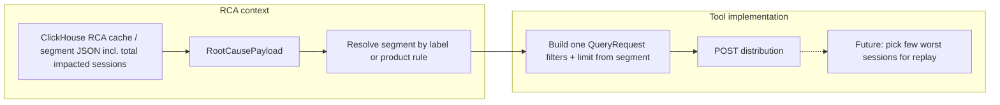

# RCA agent: poor sessions via performance distribution API

This document explains how to design a **tool** for the RCA pipeline that returns **sessions where an interaction looks bad**, using the same telemetry window as root-cause analysis and the **`POST /v1/interactions/performance-metric/distribution`** API (`QueryRequest`). It complements the field-level API reference in the repo notes for `QueryRequest` (see table “Performance metric query API” / `1183260`).

---

## Current focus (phase 1)

**In scope now:** End-to-end **deterministic** wiring — correct **filters**, **time range**, **interaction**, and **`limit`** on the distribution call — so the tool always matches the RCA segment slice and a **server-provided session count**. **Out of scope for this phase:** How we shrink the distribution result to a **small “few worst sessions”** set (ranking heuristic, secondary cap, interaction score definition). That selection step is **work in progress** and can sit **after** a correct distribution call without changing the contract described here.

### Placement in the RCA report pipeline (server-driven)

- **pulse-server** runs session evidence **before** calling pulse_ai: root cause (ClickHouse) → **segment → filters** → session tool (distribution API, or ClickHouse fallback) → attach evidences to the payload the LLM receives.
- The **LLM** is only required for **narrative RCA** (executive summary, segment commentary, recommendations, and wording for an **evidences** section grounded in the server-produced session list). The session tool itself is **not** model-invoked.

### Persistence (MySQL)

- **Evidences are not embedded inside `report_body`.** Add a **separate column** on `pulse_db.rca_report_cache` (e.g. `evidences_body` `LONGTEXT` nullable, or JSON-typed if you prefer) for the serialized session-evidence payload (session ids, scores, replay pointers — exact shape TBD).
- **`report_body`** remains the main AI report JSON; the API/handler **merges** `report_body` + `evidences_body` into one response for the UI when serving a cache hit.

### Regenerate

- **`regenerate: true` must recompute the full path:** ClickHouse root-cause cache refresh (if applicable) → session evidence step → pulse_ai → upsert **both** `report_body` and `evidences_body`. No partial reuse of old evidences with new segments.

### Timeouts

- Root cause + distribution (or ClickHouse) + LLM in one request needs more headroom than today’s **120s** (`AiProxyController` `@Timeout`, `AiUpstreamProxyExecutor` `UPSTREAM_TIMEOUT_MS`). **Raise timeouts consistently** on the proxy entry, upstream client, and any pulse_ai RCA deadline so a single report request does not 504 under normal load.

---

## Goals

- **Align with RCA:** Same interaction, same **time range**, same **project** as `RootCausePayload` / `GET .../root-cause`.
- **Use one segment:** Evidence / poor-session listing is scoped to a **single** `RootCauseSegment` (one slice = one AND of dimension filters). **Which** segment to use is a **product decision** (see below); the distribution integration stays the same.
- **Deterministic `limit`:** The distribution request’s **`limit`** should come from a **persisted total impacted (distinct) session count** for that segment (see below), not from an arbitrary LLM-chosen number — so replays / evidences are reproducible for the same cached RCA row + segment.
- **Server-built requests:** `QueryRequest` and any **direct ClickHouse** fallback SQL are assembled in pulse-server from segment dimensions + RCA window; no LLM-supplied filter names or limits for evidences.

### Segment selection (product — TBD)

The UI/PM choice is **which** single segment row from root-cause output to attach to session replay / evidences. Two approaches (same as team discussion: **overall / major impacted** vs **most specific slice after drill-down**):

| Approach | Meaning | Example | Effect on `dimensions` |
|----------|---------|---------|-------------------------|
| **Major segment** | Worst **high-level** bucket; “overall” impacted cohort | e.g. **Android** only | Fewer keys in `dimensions` (wider cohort, more sessions match). |
| **Deepest drill-down** | The **most specific** segment reached in the RCA tree (leaf slice) | e.g. **Android + OS 14 + App 1.1.2** | More keys in `dimensions` (narrower cohort, closest to the leaf RCA node). |

**Technical note (same as in your discussion):** Implementation is **almost the same** either way: still **one** `POST .../distribution`, same shape of `QueryRequest`; only the **filter map** copied from the chosen segment changes (how many `EQ` predicates). Rank or heuristic logic that *picks* “overall vs leaf” lives **outside** the distribution call (e.g. server resolves the winning segment’s **`label`** and, if the tool runs without a label, uses that row’s `dimensions`).

The rest of this doc assumes **one** chosen segment and **one** distribution call.

---

## Concepts

### 1. Root-cause segment = one AND of dimension filters

Each segment in the root-cause payload carries:

| Field | Meaning |
|--------|--------|
| `label` | Human-readable slice (e.g. hierarchical `"Android + App 3.4.5 + Jio"` or flat `"Platform: Android"`). |
| `dimensions` | **Map: ClickHouse column name → value.** All entries apply together as **AND** (same as `RootCauseQueryBuilder.appendDimensionFilters`). |
| `metrics` / `deltas` | Aggregates vs baseline; use these to decide which **distribution `select`** functions matter. |
| **Total impacted sessions (planned)** | Distinct **`SessionId`** count for that segment slice in the RCA window — same semantic as root-cause SQL (`uniqCombined64(nullIf(SessionId, ''))` over `otel_traces` with interaction + time + segment **filters**). Intended to be **stored** with RCA cache data (e.g. per-segment inside `otel.root_cause_cache`’s `segments` JSON and/or a dedicated ClickHouse column if you want a single aggregate — product/schema choice). This number is the **deterministic `limit`** for the distribution call in phase 1. |

So **one segment** is one rectangular slice:  
`Platform = 'android' AND OsVersion = '13' AND ...`

The root-cause payload can still contain **many** segment rows; **product picks one** for evidences / session list.

**Assumption check:** “Total impacted” here means **all distinct sessions that have interaction spans in that slice** (same cohort root-cause already aggregates over). It is **not** (unless you redefine it later) “sessions that are poor on this interaction only” — poor-session **ranking** is what the distribution query + `orderBy` (and future trimming) are for. If product later wants `limit` = “count of poor sessions only,” that requires a **different** metric/expression and must stay in sync with distribution filters.

### 2. `QueryRequest` building blocks (short)

| Field | Role |
|--------|------|
| `dataType` | For interaction spans in `otel_traces`, use `"TRACES"`. |
| `timeRange` | `{ "start", "end" }` ISO-8601 — **must match** the root-cause window for that interaction date. |
| `filters` | Extra predicates; combined with server-side project scoping. Use **`EQ`** / **`IN`** / **`LIKE`** per field; **`ADDITIONAL`** is raw SQL — avoid unless necessary. |
| `select` | List of `SelectItem` (`function` + `param` + optional `alias`) — aggregates **at the grain of `groupBy`**. |
| `groupBy` | Columns that define **one row per group** (e.g. one row per session). |
| `orderBy` | Sort (e.g. worst sessions first). |
| `limit` | Row cap (server default often 100). In phase 1 this should be set from **stored total impacted session count** (after clamping — see risks below). |

Response: `fields[]` + `rows[][]` (string cells).

### 3. Filters vs `groupBy` (critical)

| Mechanism | Use for |
|-----------|---------|
| **`filters`** | Pin the **segment**: interaction scope + each `dimensions` entry as `EQ`. |
| **`groupBy`** | Choose **grain**: for a **session list**, include **`SessionId`** (and optionally more if you want breakdown inside the slice). |

Do **not** confuse “dimensions that define the segment” with “dimensions to group by.” Segment-defining dimensions belong in **`filters`** when the slice is fixed. If you also `GROUP BY` those columns, every row shares the same values — redundant unless you intentionally run a **wide** query across many slices.

---

## Choosing `select` from baseline vs segment

Use **`metrics`** and **`deltas`** on the chosen segment:

1. Sort metrics by **severity** (e.g. large negative Apdex delta, large positive error-rate delta).
2. Map the worst few to **`Functions`** in `select` (see `Functions` enum / `1183260`): e.g. `APDEX`, `ERROR_RATE`, `USER_CATEGORY_POOR`, `DURATION_P95`, `INTERACTION_ERROR_COUNT`, etc.
3. Always include a **`COL`** on **`SessionId`** so rows identify sessions.
4. Add **`orderBy`** on a column that reflects “badness” (often an alias from `select`).

Exact `field` names for `COL` must match what the distribution / ClickHouse layer expects for traces (consistent with other interaction queries).

---

## Multi-slice (not in current product scope)

If you ever need **several** segments in one flow (e.g. compare two slices in the UI): `filters` are normally **AND**-ed, so “segment A **or** segment B” is not one simple `QueryRequest` unless you use **`ADDITIONAL`** SQL or run **one distribution call per segment** and merge results. A narrow case is merging values on **one** dimension with **`IN`**. This doc does not specify that UX.

---

## Dimension filtering: concrete pattern

Given a segment:

```json
{
  "label": "Platform: Android + OsVersion: 13",
  "dimensions": {
    "Platform": "android",
    "OsVersion": "13"
  },
  "metrics": { "...": "..." },
  "deltas": { "error_rate": 22.4, "apdex": -0.18 }
}
```

Build **extra** `filters` (in addition to interaction + time + project context the server applies):

```json
[
  { "field": "Platform", "operator": "EQ", "value": ["android"] },
  { "field": "OsVersion", "operator": "EQ", "value": ["13"] }
]
```

**Rule:** Keys in `dimensions` must match **`Filter.field`** names the metric pipeline accepts for `TRACES` (same names root cause uses in SQL). **Do not** let the LLM invent field names; **copy from `payload.segments[].dimensions`.**

---

## Example: one segment → session-oriented `QueryRequest`

Illustrative only — adjust `field` strings and `select` functions to match your deployed metric mappings.

**Scenario:** Interaction `checkout_flow`, RCA window `2025-11-07T00:00:00Z`–`2025-11-12T23:59:59Z`, segment Android / OS 13. You care about error signal and Apdex at **session** grain.

```json
{
  "dataType": "TRACES",
  "timeRange": {
    "start": "2025-11-07T00:00:00.000Z",
    "end": "2025-11-12T23:59:59.999Z"
  },
  "filters": [
    { "field": "span.name", "operator": "IN", "value": ["checkout_flow"] },
    { "field": "Platform", "operator": "EQ", "value": ["android"] },
    { "field": "OsVersion", "operator": "EQ", "value": ["13"] }
  ],
  "select": [
    { "function": "COL", "param": { "field": "SessionId" }, "alias": "sessionId" },
    { "function": "INTERACTION_ERROR_COUNT", "alias": "error_count" },
    { "function": "APDEX", "alias": "apdex" },
    { "function": "USER_CATEGORY_POOR", "alias": "poor_spans" }
  ],
  "groupBy": ["sessionId"],
  "orderBy": [
    { "field": "error_count", "direction": "DESC" },
    { "field": "apdex", "direction": "ASC" }
  ],
  "limit": 50
}
```

In **phase 1**, replace the illustrative `"limit": 50` with **`limit` = segment’s stored total impacted session count** (after `min(count, server_max_limit)` if you enforce a ceiling — see **Risks**).

Notes:

- Interaction scoping may also require **`PulseType`** (or equivalent) filters if your pipeline does not inject them automatically — mirror whatever the UI / other trace queries use for **interaction** spans.
- `groupBy` uses the **alias** `sessionId` if your server expects aliases in `groupBy` for `COL`; if not, use the same identifier the metric service documents for grouped columns.

---

## Tool inputs (pulse-server internal; optional UI hooks later)

**Time range**, **interaction**, **segment filters**, and **distribution `limit`** come from RCA context and stored **`total_sessions`** (per segment), not from pulse_ai.

| Input source | Purpose |
|--------------|---------|
| Product rule or future **UI-provided segment id / label** | Resolves which single segment row drives evidences (e.g. deepest drill-down first). |
| Optional **metric_focus** (config or UI, not LLM) | Ordered list of metric keys → drives distribution `select` if you expose tuning without the model. |
| **Limit** | **`limit`** on `QueryRequest` = **stored total impacted session count** for the resolved segment. When the distribution API **max `limit` is lower** than that count, do **not** silently truncate the cohort: use **direct ClickHouse query** (same filters, session grain, order) to fetch/rank sessions, or paginate — see **Risks**. |

**Server resolution (phase 1 contract):**

1. Resolve **one** segment (by `segment_label` or product rule).
2. Build **`filters`**: interaction + time (from RCA context) + **EQ** from `segment.dimensions` (same names as root cause).
3. Set **`limit`** = value from segment payload/cache (**total impacted sessions**). If missing (old cache rows), fall back policy: recompute count once, or reject with a clear error — **do not** silently default to an arbitrary number if determinism matters.
4. Build **`select`** / **`groupBy`** / **`orderBy`** as today; **which rows surface as “few worst”** for session replay may later add a stricter cap or post-processing — **not** defined in phase 1.

Implementation: find segment where `label` equals `segment_label` (after optional **trim / normalize whitespace** if you add it); then map `metric_focus` → `SelectItem` and `dimensions` → `filters`. **Do not** use list indices — order of `segments[]` can change between runs.

### Examples (conceptual)

**1. Server chooses the segment (no `segment_label`)**  
Product rule picks the row (e.g. deepest drill-down or worst major bucket). The tool omits `segment_label`; implementation resolves `dimensions` from that chosen row.

```json
{}
```

**2. Caller passes `segment_label` (UI or internal resolver)**  
The string must match a payload segment’s `label` exactly when you add an explicit picker.

```json
{
  "segment_label": "Platform: Android + OsVersion: 14"
}
```

(Distribution **`limit`** comes from that segment’s **stored total impacted session count**, not from JSON here.)

**3. With optional `metric_focus`**  
Keys are allowlisted and map to `Functions` (e.g. `error_rate` → `ERROR_RATE`, `apdex` → `APDEX`).

```json
{
  "segment_label": "Android + App 3.4.5 + Jio",
  "metric_focus": ["error_rate", "apdex", "duration_p95", "poor_user_pct"]
}
```

**4. What the server does (illustrative)**  
Given `segment_label: "Platform: Android + OsVersion: 14"` and a matching segment whose `dimensions` is `{ "Platform": "android", "OsVersion": "14" }` and **`total_sessions_impacted`** (or equivalent stored key) **= 847**:

- Resolves the row by **label equality** (not index).
- Sets `filters` from interaction + time (injected) + `Platform EQ android` + `OsVersion EQ 14`.
- Builds `select` from `metric_focus`: e.g. `COL SessionId`, then `ERROR_RATE`, `APDEX`, `DURATION_P95`, `POOR_USER_RATE` (per your registry).
- Sets distribution **`limit`** to **847** (subject to server max — see risks).

If `metric_focus` is omitted, use a **default column set** (e.g. `SessionId`, `APDEX`, `ERROR_RATE`, `INTERACTION_ERROR_COUNT`).

**Mismatch:** If no segment has that `label`, return a clear error (“unknown segment_label”) instead of falling back to index 0.

---

## Risks / where the flow can break

| Topic | Risk |
|--------|------|
| **Approximate count** | Root-cause SQL uses **`uniqCombined64`** (approximate distinct). Stored “total” may differ slightly from a hypothetical `uniqExact(SessionId)`. Distribution **`limit`** may then not match exact row cardinality; usually acceptable if you only need an upper bound for “scan up to this many session groups.” |
| **Server `limit` ceiling** | If distribution API enforces **`limit` ≤ N** (e.g. 100) and stored count is 10k, **do not** treat `min(count, N)` as sufficient if product requires the **full** cohort or correct top-K over all sessions. **Fallback: query ClickHouse directly** with the same logical filters, `GROUP BY` session, and `ORDER BY` as the distribution path (reuse shared filter builder / documented SQL template), optionally with pagination or a server-side cap for cost. Distribution API remains the default path when `limit` is within API bounds. |
| **Cost / latency** | Large `limit` with heavy **`select`** can make distribution slow or time out. A stored count of “eligible sessions” does not obligate returning that many rows to the LLM — phase 2 might **cap** replay candidates (e.g. top 20 by score) while still using filters aligned to the segment. |
| **Stale cache** | RCA cache is computed at **cache write** time. If telemetry changes but the user still sees an old report, stored count vs live distribution can diverge until **regenerate**. Same as today for segment metrics. |
| **Filter parity** | Distribution **`filters`** must use the **same** field names and values as root-cause segment **`dimensions`** + interaction + window. Any mismatch (e.g. `span.name` vs `SpanName`, casing) breaks alignment — validate against one shared mapping table. |
| **“Few worst sessions” (WIP)** | Returning only a handful for replay is **not** solved by `limit` alone unless `orderBy` + a **small** limit is enough. If `limit` = full cohort size, the tool must **truncate or page** later; until that exists, the tool may return **many** rows — plan UI/agent accordingly. |
| **Session tool failure** | If distribution (and optional ClickHouse fallback) fails or times out, **still call pulse_ai** with **`evidences` empty** (or an explicit error flag in payload) so the narrative report can complete; do not fail the entire RCA report unless product requires hard failure. |

---

## Flow (mental model)



---


## Related references

| Topic | Where |
|--------|--------|
| RCA pipeline overview | `doc/rca-agent-interactions-overview.md` |
| `QueryRequest` fields, `Functions`, examples | Repo note `1183260` / `backend/server/README.md` (distribution section) |
| Segment Java model | `RootCauseSegment.java` (`label`, `dimensions`, `metrics`, `deltas`) |
| Segment WHERE construction | `RootCauseQueryBuilder.appendDimensionFilters` |

---

## Summary

1. **Default product path:** **One** chosen segment ⇒ **one** distribution call ⇒ **AND** of `EQ` filters from that segment’s `dimensions` + interaction + time.
2. **Which segment row** (broad “major impacted” vs **deepest drill-down**) is **product/policy**; it only changes how many dimension keys you copy into `filters`, not the overall integration shape.
3. **`groupBy`** for session lists should center on **`SessionId`**; segment dimensions are primarily **`filters`**.
4. **`select`** should reflect **off-baseline metrics** for that segment, plus **`SessionId`**, with **`orderBy`** for worst-first ordering (foundation for future “few worst” replay selection).
5. **Server-side assembly** of `QueryRequest` (and **ClickHouse fallback** when API `limit` is insufficient); segment **selection** via product rule or future UI; optional **`metric_focus`** from config/UI only.
6. **Phase 1:** Persist **`total_sessions`** per segment in ClickHouse RCA cache; tool uses it as distribution **`limit`** when within API bounds; otherwise **direct ClickHouse** (or pagination) per policy above. **Phase 2 (WIP):** Reduce to a **small** replay set via ranking.
7. **MySQL:** Store **`evidences_body`** (separate column) + **`report_body`**; **regenerate** recomputes both; **increase RCA proxy/upstream timeouts** for the longer pipeline.
