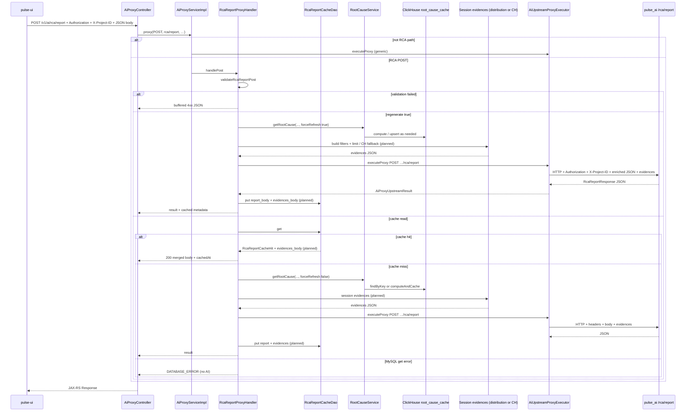

# RCA report request flow (`POST /v1/ai/rca/report`)

End-to-end path from the browser through **pulse-server** to **pulse_ai**, including MySQL report caching, ClickHouse-backed root-cause enrichment, session evidences, and upstream HTTP. All step names below match symbols in the repo unless a row is marked **(planned)**.

### Planned product additions (design — not all implemented in code yet)

| Topic | Decision |
|--------|-----------|
| **Session evidences** | Before calling pulse_ai, pulse-server runs a **session evidence** step: chosen RCA segment → filters for **`POST .../performance-metric/distribution`** (or **direct ClickHouse** if distribution **`limit`** is capped below the segment’s stored session count). Output becomes an **evidences** payload for the LLM and for the UI. |
| **MySQL** | **Evidences are not inside `report_body`.** Add a **second column** on `rca_report_cache` (e.g. `evidences_body` `LONGTEXT` nullable) alongside `report_body`. Cache **read** returns both; the handler **merges** them into one JSON response for the client. |
| **Regenerate** | **`regenerate: true`** recomputes **everything**: root cause (ClickHouse), session evidences, then pulse_ai, then upserts **both** columns. |
| **Timeouts** | Today the RCA path uses **120s** on `AiProxyController` and `AiUpstreamProxyExecutor`. **Increase** these (and align pulse_ai RCA deadlines) so root cause + distribution/ClickHouse + LLM fit without 504. |
| **Failure** | If the session step fails, still call pulse_ai with **empty or flagged evidences** so the narrative report can complete unless product mandates hard failure. |

See `doc/rca-poor-sessions-distribution-tool-design.md` for distribution vs ClickHouse fallback.

## 1. Client (pulse-ui)

The UI **does** call this endpoint directly (not only a generic AI path constant elsewhere).

| Step | Location |
|------|----------|
| Route constant | `pulse-ui/src/constants/API.ts` — `POST_RCA_REPORT_ROUTE` (`apiPath: "/v1/ai/rca/report"`, `method: "POST"`) |
| Initial fetch | `pulse-ui/src/hooks/useGetRcaReport/useGetRcaReport.ts` — `useQuery` `queryFn` builds URL as `` `${API_BASE_URL}${POST_RCA_REPORT_ROUTE.apiPath}` ``, body `{ interactionName, date? }`, optional `X-Project-ID` in `init.headers` when `projectId` is set |
| Regenerate | `pulse-ui/src/hooks/useRegenerateRcaReport/useRegenerateRcaReport.ts` — `useMutation` `mutationFn` posts the same URL with `{ interactionName, date?, regenerate: true }` |
| HTTP + auth merge | `pulse-ui/src/helpers/makeRequest/makeRequest.ts` — `makeRequest` → `makeRequestToServer` |
| Headers | `pulse-ui/src/helpers/makeRequestToServer/makeRequestToServer.ts` — `buildAuthHeaders()` adds `Authorization` from cookies (`COOKIES_KEY.ACCESS_TOKEN`, `TOKEN_TYPE`), may add `X-Project-ID` from `sessionStorage` (`pulse_project_context`); `makeRequestToServer` merges `...authHeaders` then caller `headers`, so hook-supplied `X-Project-ID` overrides when present |

Other AI traffic (e.g. chat) uses the same host with paths like `/v1/ai/run_sse` (`pulse-ui/src/constants/aiApiPaths.ts`). RCA report is a **dedicated** leaf route under the same `/v1/ai/*` proxy namespace.

## 2. JAX-RS entry (pulse-server)

| Step | Location |
|------|----------|
| Controller | `backend/server/src/main/java/org/dreamhorizon/pulseserver/resources/v1/ai/AiProxyController.java` |
| Class-level auth | `@RequiresPermission("can_view")` on `AiProxyController`; Javadoc references `AuthorizationFilter` + JWT validation |
| Timeout | `@Timeout(value = 120000, httpStatusCode = 504)` (120s) today; **raise** when session evidences + LLM are in the same request (keep in sync with `AiUpstreamProxyExecutor` and pulse_ai RCA timeout) |
| POST handler | `proxyPost(@PathParam("path") String path, @HeaderParam("Authorization") String authorization, @HeaderParam("X-Project-ID") String projectId, …, InputStream bodyStream)` → `readBodyUtf8(bodyStream)` (`AiProxyResponseSupport`) → `aiProxyService.proxy("POST", path, rawQuery(uriInfo), body, authorization, projectId)` → `toJaxRsResponse` |

For `path = "rca/report"`, the effective external URL is **`POST /v1/ai/rca/report`** (JAX-RS `@Path("/v1/ai")` + `@Path("/{path:.*}")`).

## 3. AI proxy service routing

| Step | Location |
|------|----------|
| Implementation | `backend/server/src/main/java/org/dreamhorizon/pulseserver/service/ai/impl/AiProxyServiceImpl.java` |
| RCA branch | `proxy(...)` — if `"POST".equals(method)` and `"rca/report".equals(path)` and `rcaReportProxyHandler != null`, returns `rcaReportProxyHandler.handlePost(rawQuery, body, authorization, projectId)` |
| Default proxy | Otherwise `upstreamExecutor.buildTargetUrl(path, rawQuery)` + `upstreamExecutor.executeProxy(method, targetUrl, body, authorization, projectId)` |

Production wiring constructs `RcaReportProxyHandler` with `RootCauseService` and `RcaReportCacheDao` (`wiringForFullPipeline`).

## 4. RCA handler: validation, cache, enrich, finalize

`backend/server/src/main/java/org/dreamhorizon/pulseserver/service/ai/impl/RcaReportProxyHandler.java`

| Phase | Method / behavior |
|-------|-------------------|
| Entry | `handlePost(rawQuery, body, authorization, projectId)` |
| Validation | `validateRcaReportPost(body, projectId)` — non-blank JSON object body, required `X-Project-ID`, required `interactionName`; parses `date` (`resolveDateFromNode`, default UTC today) and `regenerate` (`isRegenerateRequested`) |
| Regenerate short-circuit | If `regenerate == true`: `doEnrichAndProxyRca` with `forceRootCauseRefresh = true`, then `finalizeSuccessfulRcaProxyResult` — **skips** MySQL read |
| Cache read path | If not regenerate: `proxyRcaAfterMysqlCacheLookup` → `rcaReportCacheDao.get(projectId, interactionName, date)` |
| Cache hit | On `Maybe` value: `AiProxyUpstreamResult.buffered(200, …, applyCacheMetadata(hit.reportBody(), true, hit.cachedAt()))` — **(planned)** merge `evidences_body` from MySQL into the response payload with `report_body` |
| Cache miss | On empty: `doEnrichAndProxyRca(..., forceRootCauseRefresh = false)` → **(planned)** session evidence step after root cause → `finalizeSuccessfulRcaProxyResult` |
| DAO read error | `rcaCacheReadFailedResult()` — HTTP status from `ServiceError.DATABASE_ERROR`, no upstream AI call |
| Enrichment | `enrichRcaBodyAsync(parsed, forceRootCauseRefresh)` — copies body, removes `regenerate`, calls `rootCauseService.getRootCause(projectId, interactionName, date, forceRootCauseRefresh)`, sets JSON field `rootCausePayload` on success; on failure logs and sends **original** body (`fallbackBody`) |
| Session evidences **(planned)** | After `rootCausePayload` is set: resolve **one** segment (product rule), map `dimensions` → distribution filters, use stored **`total_sessions`** as `limit` when API allows; **else** equivalent **ClickHouse** query. Attach evidences JSON to the body sent upstream. |
| Upstream call | `doEnrichAndProxyRca` → `upstream.executeProxy("POST", targetUrl, enrichedBody, authorization, projectId)` |
| Success persistence | `finalizeSuccessfulRcaProxyResult` — for 2xx buffered non-empty JSON: `applyCacheMetadata(..., true, Instant.now())`, then `rcaReportCacheDao.put(...)` for **`report_body`** — **(planned)** separate `put` or extended upsert for **`evidences_body`** |

`targetUrl` is built with `upstream.buildTargetUrl("rca/report", rawQuery)` → `{AI_SERVICE_URL}/rca/report` (+ query if any).

## 5. Upstream HTTP executor

`backend/server/src/main/java/org/dreamhorizon/pulseserver/service/ai/impl/AiUpstreamProxyExecutor.java`

| Item | Detail |
|------|--------|
| URL | `buildTargetUrl(path, rawQuery)` → `aiServiceUrl + "/" + path` |
| Request | `executeProxy(method, targetUrl, body, authorization, projectId)` |
| Headers | `applyCommonHeaders` — always `Authorization`; `X-Project-ID` if non-blank |
| Timeout | `UPSTREAM_TIMEOUT_MS` = 120_000 — **increase** with `AiProxyController` when evidences + LLM share one request |
| Body | POST/PUT with body sets `Content-Type: application/json` and sends UTF-8 buffer |

## 6. MySQL cache DAO

`backend/server/src/main/java/org/dreamhorizon/pulseserver/dao/rcareport/RcaReportCacheDao.java`

- `get` — `RcaReportCacheQueries.GET_BY_KEY` on table `rca_report_cache` (`RcaReportCacheQueries.java`) — **(planned)** also select `evidences_body`
- `put` — `RcaReportCacheQueries.UPSERT` (skips if `reportBody` blank) — **(planned)** persist `evidences_body` in the same or follow-up write

## 7. Root cause enrichment (ClickHouse)

`backend/server/src/main/java/org/dreamhorizon/pulseserver/service/rootcause/RootCauseService.java`

- `getRootCause(projectId, interactionName, date, forceRefresh)` — if `forceRefresh`, `computeAndCache`; else `cacheDao.findByKey` then hit → `fromCacheRow` or miss → `computeAndCache`
- `computeAndCache` runs baseline/segment queries via `ClickhouseQueryService`, upserts `root_cause_cache` through `RootCauseCacheDao.upsert`, returns `RootCauseResult` — **(planned)** include per-segment **`total_sessions`** (distinct `SessionId` in segment slice) in stored segment JSON

The handler serializes that result into the POST body as `rootCausePayload` (`ObjectMapper.valueToTree`).

## 8. pulse_ai service

| Piece | Location |
|-------|----------|
| Route | `pulse_ai/server/routes.py` — `@app.post("/rca/report")` → `generate_root_cause_report` |
| Request model | `pulse_ai/server/schemas.py` — `RcaReportRequest` (`interactionName`, optional `date`, optional `rootCausePayload`, optional `regenerate` ignored by pipeline) |
| Payload resolution | If `request.rootCausePayload` is set: `RootCausePayloadSchema.model_validate`. Else: `_require_headers_for_rca_callback` + `fetch_root_cause_payload` (`pulse_ai/server/root_cause_fetch.py`) |
| Generation | `generate_rca_report` (`pulse_ai/server/rca_runner.py`) — builds prompt from interaction + payload (including **evidences** when present), runs ADK `runner.run_async`, extracts structured report — **(planned)** extend schema/prompt for an **evidences** section |

With pulse-server’s normal enrichment path, **`rootCausePayload` is present**, so pulse_ai does not need the callback fetch for typical UI calls. Callback + headers matter if enrichment failed and the body was forwarded without `rootCausePayload`.

## 9. Auth summary

- **pulse-ui:** `Authorization` (Bearer access token from cookies) via `buildAuthHeaders`; `X-Project-ID` from session context and/or hook props (merged in `makeRequestToServer`, caller headers last).
- **pulse-server:** `AiProxyController` requires `can_view` (OpenFGA-backed permission). Reads `Authorization` and `X-Project-ID` as JAX-RS `@HeaderParam` and passes them into `AiProxyService.proxy`.
- **pulse-server → pulse_ai:** `AiUpstreamProxyExecutor` forwards the same `Authorization` and `X-Project-ID` on the Vert.x `WebClient` request.

## 10. Sequence diagram

## 11. Related generic proxy

Any other `pulse_ai` path is reached the same way: **`POST/GET/PUT/DELETE /v1/ai/{path}`** on `AiProxyController`, with **`AiProxyServiceImpl.proxy`** delegating to **`AiUpstreamProxyExecutor`** when the path is not the special `rca/report` POST branch.
