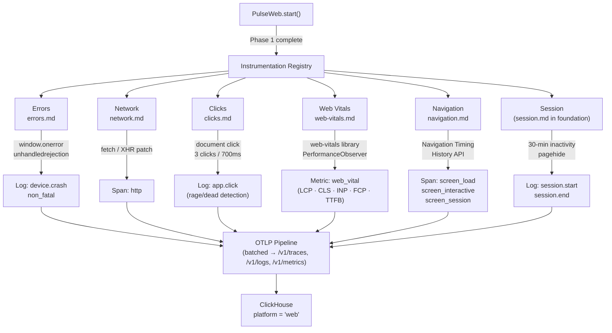

# Core Instrumentations — Flow & Summary

Six auto-instrumentations that activate immediately after `PulseWeb.start()`. Each follows the same `install()` / `uninstall()` contract from the foundation and can be independently disabled via config or remote SDK Config.

---

## Flow

---

## Signal Reference

| Signal | Kind | Instrumentation | Key Attributes |
|---|---|---|---|
| `device.crash` | Log | errors.md | `error.message`, `error.stack`, `error.type` |
| `non_fatal` | Log | errors.md | `error.message`, `error.stack`, `promise.rejection` |
| `http` | Span | network.md | `http.url`, `http.method`, `http.status_code`, `http.duration_ms` |
| `app.click` | Log | clicks.md | `element.tag`, `click.x`, `click.y`, `app.click.rage` |
| `web_vital` | Metric | web-vitals.md | `metric.name`, `metric.value`, `metric.rating`, attribution |
| `screen_load` | Span | navigation.md | `screen.name`, `load.duration_ms`, `ttfb_ms` |
| `screen_interactive` | Span | navigation.md | `screen.name`, `tti_ms` |
| `screen_session` | Span | navigation.md | `screen.name`, `previous.screen.name`, `duration_ms` |
| `session.start` | Log | session.md | `session.id`, `session.previous_id`, `session.start_reason` |
| `session.end` | Log | session.md | `session.id`, `session.duration_ms`, `session.end_reason` |

---

## Sub-Documents

| File | Signal(s) | Priority |
|---|---|---|
| [errors.md](./errors.md) | `device.crash`, `non_fatal` | V1 |
| [network.md](./network.md) | `http` span | V1 |
| [clicks.md](./clicks.md) | `app.click` | V1 |
| [web-vitals.md](./web-vitals.md) | `web_vital` metric | V1 |
| [navigation.md](./navigation.md) | `screen_load`, `screen_interactive`, `screen_session` | V1 |

---

## Key Design Decisions

| Decision | Rationale |
|---|---|
| All 6 instrumentations built in parallel | Independent, zero shared state — unblock multiple engineers simultaneously |
| Rage click threshold: 3 clicks / 700ms | Empirically derived; matches industry standards for frustration detection |
| `web-vitals` library for vitals | Google-maintained, handles all browser quirks and PerformanceObserver edge cases |
| `screen.name` heuristic stripping numeric IDs | Prevents high-cardinality URLs flooding dashboards (e.g. `/product/12345` → `/product/:id`) |
| Pulse ingest endpoints excluded from network tracing | Prevents infinite loops of SDK tracking its own exports |
