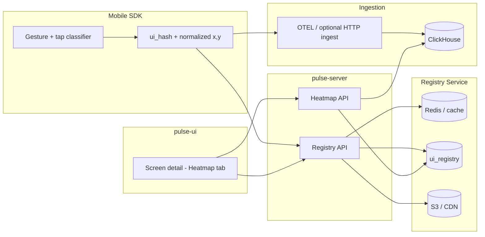

# Heatmap Feature — Integrated Architecture & API Specification

This document merges **Pulse platform context** (existing OTEL ingestion, Screen detail UI, project-scoped queries) with the **Registry + ClickHouse + layered heatmap** design. It is the single reference for engineering alignment across SDK, backend, data, and UI.

---

## 1. Goals

| Goal | Description |
|------|-------------|
| **Deduplicate screenshots** | “Check-before-upload” so identical layouts (`ui_hash`) map to one canonical asset in object storage. |
| **Fast heatmap reads** | Pre-aggregated buckets + optional Redis/registry lookups for sub-second UI. |
| **Filterable UI** | Pulse UI filters heatmaps by **screenName**, **app_version**, **aspect_ratio**, **platform**, cohort, time range. |
| **Layered visualization** | Separate **volume (glow)**, **frustration (rage/dead)**, **observability (latency/errors)** toggles. |

**Non-goals (for this spec):** Replacing existing crash/ANR/API pipelines; those stay screen-scoped via current APIs.

---

## 2. End-to-end data flow



**Summary:** The SDK computes **`ui_hash`** and **normalized coordinates**, participates in **check-before-upload**, and emits **classified events** into the analytics store. The **UI** loads **screenshot URL** from the registry path and **layered buckets** from ClickHouse (via the backend).

---

## 3. Registry: `ui_registry` and Redis

### 3.1 Purpose

- **Canonical link** between a **structural fingerprint** (`ui_hash`) and a **visual asset** (`screenshot_url`).
- **Redis** (or equivalent) holds a **hot cache** for `ui_hash → exists + url` to make **`POST /v1/registry/check`** O(1) at high QPS.

### 3.2 Logical schema: `ui_registry`

| Column | Type | Constraints | Description |
|--------|------|-------------|-------------|
| `ui_hash` | `VARCHAR(64)` | **PRIMARY KEY** | Stable fingerprint of layout (e.g. SHA-256 of structure key; *not* the literal concatenation of fields—hash **derived from** screen structure + version + platform + aspect class). |
| `screen_name` | `VARCHAR(255)` | Indexed | Human-readable anchor (e.g. `new_checkout_flow_v2`). |
| `app_version` | `VARCHAR(50)` | Indexed | Release version string. |
| `aspect_ratio` | `VARCHAR(20)` | — | Bucket for layout alignment (e.g. `19.5:9`, `16:9`). |
| `platform` | `VARCHAR(20)` | NOT NULL | `Android` / `iOS` (and future). |
| `screenshot_url` | `TEXT` | NOT NULL | S3 / CloudFront path to WebP/HEIC (or PNG). |
| `created_at` | `TIMESTAMP` | Default `NOW()` | First time this layout was registered. |

**Lookup keys for UI:** `screen_name` + `app_version` + `aspect_ratio` + `platform` (+ time if multiple versions of asset exist—product decision: “latest in range” vs pinned).

---

## 4. Registry API — check-before-upload

### `POST /v1/registry/check`

**Purpose:** Avoid redundant uploads; return a **pre-signed upload URL** only when the layout is new.

**Request (example):**

```json
{
  "ui_hash": "sha256_abc123…",
  "screenName": "new_checkout_flow_v2",
  "app_version": "2.1.0",
  "cohort_id": "premium_subscribers",
  "aspect_ratio": "19.5:9",
  "platform": "Android"
}
```

**Responses:**

| HTTP | Meaning | Body |
|------|---------|------|
| **204 No Content** | Layout already registered | Empty — SDK **skips** upload |
| **200 OK** | New layout | `{ "upload_url": "https://s3…/presigned…" }` |

**Pulse integration notes:**

- In production, require **project/API key** or **session** (same as other ingest endpoints).
- **Redis:** cache `ui_hash` existence and optional `screenshot_url` to reduce DB load.

---

## 5. SDK: event taxonomy and detection

### 5.1 Event types (product)

| Event type | Detection (illustrative) | Meaning |
|------------|---------------------------|---------|
| **Normal tap** | Single tap on a hit-tested target | Standard intent |
| **Rage tap** | ≥ 3 taps in &lt; 700 ms (threshold tunable) | Frustration / lag / broken control |
| **Dead tap** | Tap on non-interactive region (listener/metadata) | Misleading UI / “fake” control |
| **Error** (optional) | Tap correlated with error span / failed request | Tie-in to observability layer |

**Canonical names:** Align **JSON**, **ClickHouse `Enum8`**, and **API** on one set (see §8.1).

### 5.2 SDK payload (ingestion-bound)

```json
{
  "event_type": "rage",
  "screenName": "new_checkout_flow_v2",
  "app_version": "2.1.0",
  "timestamp": "2026-03-23T10:00:00Z",
  "normalised_coordinates": { "x": 0.45, "y": 0.82 },
  "aspect_ratio": "16:9",
  "platform": "Android",
  "ui_hash": "sha256_abc123…",
  "trace_id": "otel-trace-987",
  "latency_ms": 120,
  "cohort_id": "premium"
}
```

- **`ui_hash`** must match the same fingerprint used in **registry check** for that screen snapshot.
- **`normalised_coordinates`:** `x`, `y` in **0.0–1.0** relative to the **active layout bounds** used when computing `ui_hash` (document coordinate convention in SDK docs).

### 5.3 Optional dedicated ingest endpoint

`POST /v1/ingest/events` (or equivalent) can accept the JSON above for a **non-OTEL** path.

**Pulse today:** Telemetry often flows **OTLP → Collector → ClickHouse**. The implementation choice is:

- **A)** Map these fields to **OTEL log/span attributes** and reuse the existing pipeline, **or**
- **B)** A small **HTTP → Kafka/Vector → ClickHouse** writer for `interaction_events`.

The **logical model** in §7 is the same either way.

---

## 6. Pulse UI contract (layers + metadata)

The backend returns **structured JSON** (not only flat `fields`/`rows`) so the Heatmap tab can toggle **Glow / Frustration / Observability** independently.

### 6.1 Response shape (normative for UI)

```json
{
  "metadata": {
    "screenName": "new_checkout_flow_v2",
    "ui_hash": "sha256_abc123…",
    "screenshot_url": "https://cdn…/img_abc123.webp",
    "total_events": 15420,
    "app_version": "2.1.0",
    "platform": "Android",
    "aspect_ratio": "19.5:9",
    "created_at": "2026-03-01T12:00:00Z"
  },
  "layers": {
    "glow_map": [
      { "x": 0.45, "y": 0.82, "weight": 10000 }
    ],
    "frustration_map": {
      "rage": [{ "x": 0.45, "y": 0.82, "weight": 450, "avg_sequence_count": 5 }],
      "dead": [{ "x": 0.10, "y": 0.10, "weight": 120 }]
    },
    "observability_map": {
      "error_clicks": [{ "x": 0.88, "y": 0.05, "weight": 15, "error_code": "500" }],
      "latency_hotspots": [{ "x": 0.50, "y": 0.50, "avg_latency_ms": 2450, "weight": 300 }]
    }
  }
}
```

- **`x` / `y`:** Same normalization as storage (0–1). UI maps to pixels: `pixelX = x * containerWidth`.
- **`weight:** Drives **intensity** for glow (heatmap.js, canvas blur, or WebGL).
- **Frustration:** Optional **icons** at coordinates when layer is enabled.
- **Latency:** Optional **warning styling** when `avg_latency_ms` exceeds threshold.

### 6.2 Suggested HTTP API (Pulse-aligned)

| Method | Path | Notes |
|--------|------|--------|
| `GET` | `/v1/heatmap/data` | Query params: `screenName`, optional `app_version`, `cohort_id`, `from`, `to`, `platform`, `aspect_ratio`, layer flags |
| `POST` | `/api/v1/screens/heatmap` | Preferred if filters are large — **body** mirrors `HeatmapFilterContext` + `ui_hash`/`screenName` |

**Auth:** **Project-scoped** (JWT / API key) — same as `QueryRequest` flows; never expose raw ClickHouse.

---

## 7. ClickHouse schema

### 7.1 Raw table: `interaction_events` (source of truth)

Append-only events (OTEL/Vector/custom writer).

| Column | Type | Notes |
|--------|------|--------|
| `timestamp` | `DateTime64(3)` | Event time |
| `event_type` | `Enum8('normal'=1,'rage'=2,'dead'=3,'error'=4)` | Aligned with SDK |
| `screenName` | `LowCardinality(String)` | |
| `ui_hash` | `FixedString(64)` | Join key to registry |
| `cohort_id` | `LowCardinality(String)` | `ALL` or segment |
| `app_version` | `LowCardinality(String)` | |
| `x_per` | `Float32` | 0–1 |
| `y_per` | `Float32` | 0–1 |
| `trace_id` | `String` | Link to traces |
| `latency_ms` | `UInt32` | Optional per tap |
| `aspect_ratio` | `LowCardinality(String)` | |
| `platform` | `LowCardinality(String)` | Optional if not redundant with resource attrs |

**Engine:** `MergeTree`  
**Partition:** e.g. `toYYYYMM(timestamp)`  
**ORDER BY:** `(screenName, ui_hash, timestamp)` — adjust if queries are mostly `ui_hash` + time.

### 7.2 Aggregate table: `interaction_heatmaps_daily`

| Column | Type |
|--------|------|
| `date` | `Date` |
| `screenName` | `LowCardinality(String)` |
| `ui_hash` | `FixedString(64)` |
| `event_type` | `Enum8(...)` |
| `cohort_id` | `LowCardinality(String)` |
| `app_version` | `LowCardinality(String)` |
| `x_bin` | `Float32` |
| `y_bin` | `Float32` |
| `weight` | `UInt64` |
| `total_latency_ms` | `UInt64` |

**Engine:** `SummingMergeTree`  
**ORDER BY:** `(date, screenName, ui_hash, event_type, cohort_id, app_version, x_bin, y_bin)`

### 7.3 Materialized view

Populate `interaction_heatmaps_daily` from `interaction_events` using `round(x_per, 2)` (or product-chosen bin size). **Note:** MV `GROUP BY` + `count()` must match **SummingMergeTree** merge semantics (use `sum()` for additive columns).

---

## 8. Query patterns

### 8.1 Ad hoc (raw)

```sql
SELECT
  round(x_per, 2) AS x_bin,
  round(y_per, 2) AS y_bin,
  count(*) AS weight,
  avg(latency_ms) AS avg_lat
FROM interaction_events
WHERE ui_hash = {ui_hash}
  AND event_type = 'rage'
  AND cohort_id = {cohort}
  AND timestamp >= {start} AND timestamp < {end}
GROUP BY x_bin, y_bin;
```

Use **`event_type` values exactly as defined in `Enum8`** (e.g. `'rage'`, not `'rage_tap'`) unless the enum is extended.

### 8.2 Pre-aggregated (daily)

```sql
SELECT
  x_bin,
  y_bin,
  sum(weight) AS weight,
  sum(total_latency_ms) / nullIf(sum(weight), 0) AS avg_lat
FROM interaction_heatmaps_daily
WHERE screenName = {screen}
  AND date >= {from} AND date <= {to}
  AND ui_hash = {ui_hash}
GROUP BY x_bin, y_bin;
```

Backend **assembles** `layers` JSON from separate queries or one **GROUP BY event_type** pass.

---

## 9. Backend “fetch & overlay” sequence

1. **Resolve asset:** From `screenName`, `app_version`, `platform`, `aspect_ratio`, time range → **`ui_hash`** + **`screenshot_url`** (registry / `ui_registry` + cache).
2. **Fetch layers:** Query ClickHouse for buckets matching filters; build **`glow_map`**, **`frustration_map`**, **`observability_map`**.
3. **Respond** with §6.1 JSON.

---

## 10. Frontend rendering (pulse-ui)

| Step | Action |
|------|--------|
| 1 | Load **`metadata.screenshot_url`** into an `` or background layer. |
| 2 | Stack **Canvas** or **SVG** with `position: absolute` over the image; size overlay to **image display size**. |
| 3 | **Glow:** feed `glow_map` + `weight` into heatmap renderer (e.g. heatmap.js) — high weight → hot colors. |
| 4 | **Frustration:** draw icons for `rage` / `dead` when toggled. |
| 5 | **Observability:** style **latency_hotspots** (e.g. pulse animation) when `avg_latency_ms` &gt; threshold. |
| 6 | **Resize:** On container resize, recompute `pixelX = x * width`, `pixelY = y * height`. |

**Wireframes:** See `frames.pen` — **Heatmap tab** under Screen detail; states include default, loading, empty, error, compare, filters open (`wireframes/heatmap/README.md`).

---

## 11. Mapping: document → Pulse UI surfaces

| Concept | Where it lives in Pulse |
|---------|-------------------------|
| Screen context | `ScreenDetail` route: `projectId`, `screenName` (encoded) |
| Time + header filters | `InteractionDetailsFilters`, `DateTimeRangePicker`, `useFilterStore` |
| Heatmap tab | New `Tabs.Tab` + panel; optional `?tab=heatmap` |
| Data fetch | `GET /v1/heatmap/data` or `POST .../heatmap` with project auth |
| Registry | Called from SDK at capture time; **read path** from backend when serving UI |
| Crashes / ANRs / APIs | **Reuse** existing lists — same APIs as other Screen detail tabs |

---

## 12. Open decisions & consistency checklist

| Topic | Decision needed |
|-------|-----------------|
| **Canonical `event_type` strings** | Single enum across SDK JSON, CH `Enum8`, and API (`rage` vs `rage_tap`). |
| **Ingestion path** | OTLP attributes vs dedicated `POST /v1/ingest/events`. |
| **Multiple assets per screen** | How `ui_hash` is chosen when **A/B** layouts exist (selector in UI). |
| **Project isolation** | Prefix S3 keys and/or `ui_registry` rows with **`project_id`**. |
| **CH + existing `otel_*` tables** | Either new DB `interaction_*` tables or merge into OTEL schema — **do not** duplicate crash pipelines. |
| **Redis topology** | Same cluster as other Pulse caches or dedicated registry service. |

---

## 13. References (in-repo)

| Resource | Path |
|----------|------|
| Wireframe source | `wireframes/heatmap/frames.pen` |
| Wireframe assets | `wireframes/common/assets/` |
| Screen detail (tabs) | `pulse-ui/src/screens/ScreenDetail/ScreenDetail.tsx` |
| Generic data query types | `pulse-ui/src/hooks/useGetDataQuery/useGetDataQuery.interface.ts` |
| Performance query response | `backend/server/.../PerformanceMetricDistributionRes.java` |

---

## 14. Document history

| Version | Notes |
|---------|--------|
| 1.0 | Combined colleague spec (Registry, Redis, CH, SDK, layered JSON) with Pulse architecture and UI mapping. |
